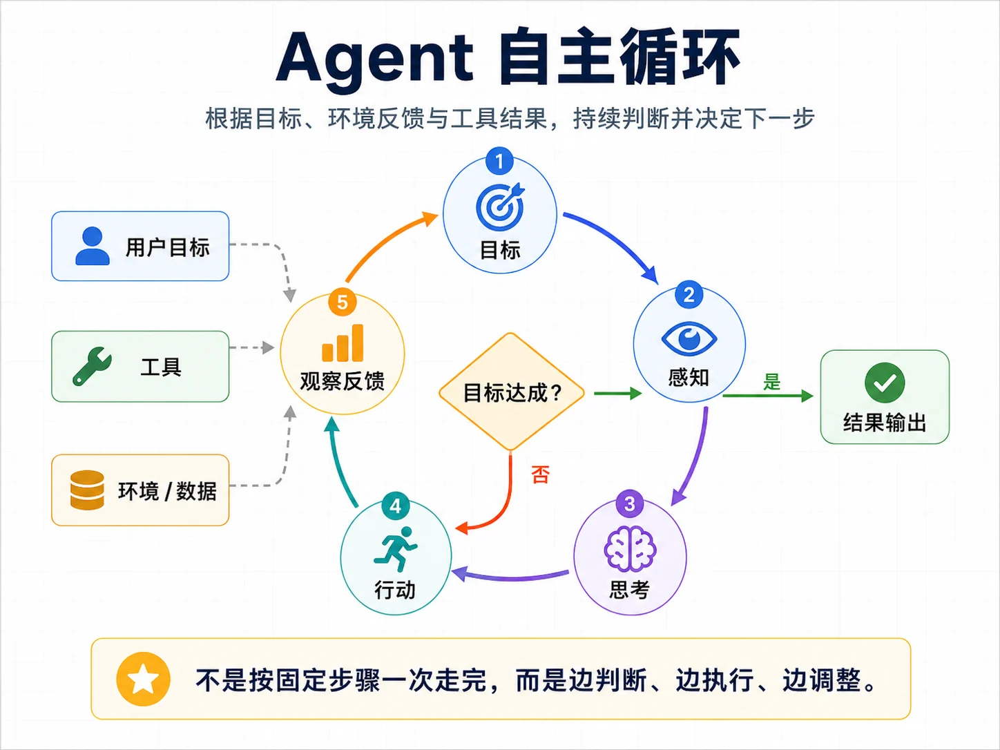
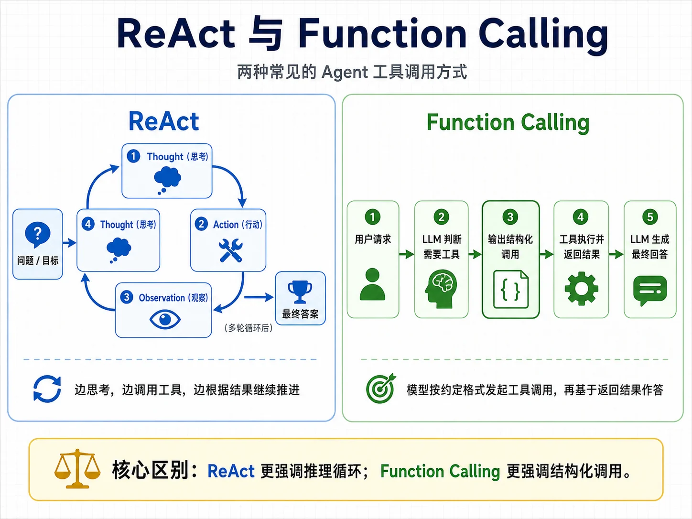
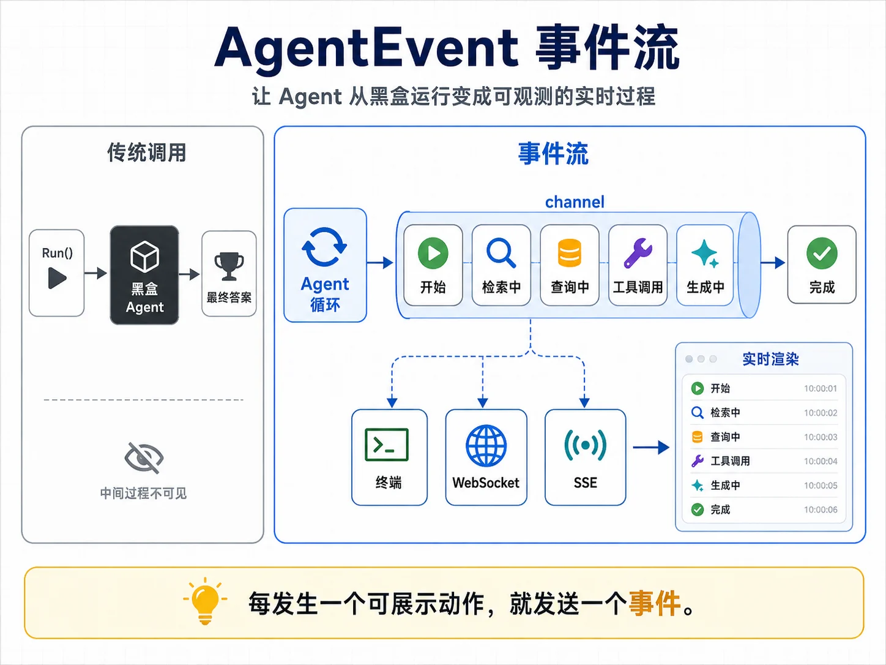
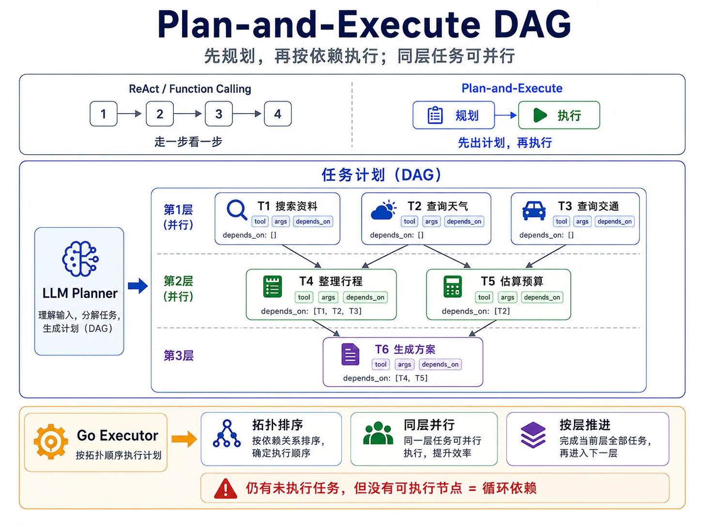

# Agent 核心架构

> 阅读说明：本文是 Agent 核心架构的独立教程。文中示例代码使用一个教学模块 `github.com/yourname/llmagent`，其中 `internal/llm`、`internal/tool`、`internal/plan` 是本文从零手写的教学包；它们与本仓库 `llm-gateway/internal/llm`、`llm-gateway/internal/schema`、`llm-gateway/internal/router` 等真实实现思路一致，但代码自成一体，无需提前阅读其他章节。

前面我们已经能完成一次稳定的模型调用：定义 `llm.Provider` 接口，用 `llm.Message` 组织消息，调用 `Chat` 得到回复。这种模式能完成总结、改写、翻译和简短问答，但仍然只是“一问一答”。

从本文开始，模型不再只是回答一个问题，而是在循环中决定下一步要做什么：是否调用工具、如何处理工具结果、是否继续执行、什么时候结束。**这个自主循环，就是 Agent 的核心。**

本文会从零手写一个最小但完整的 Agent 运行时。后面无论使用 Eino、LangChain 还是其他框架，都可以用这一章的状态机、工具调用、停止条件、事件流和持久化来理解它们内部在做什么。

## 学习目标

学完本文，你应该能够：

1. 用状态机理解 Agent 的运行机制，并说清 Agent 与普通工作流的区别；
2. 手写一个完整的 ReAct 循环，理解模型如何通过“思考、行动、观察”推进任务；
3. 实现基于 Function Calling 的循环，并说明它与 ReAct 的取舍；
4. 设计停止条件与 Token 预算，避免 Agent 死循环、超时或成本失控；
5. 处理工具报错、输出格式错误等可恢复问题，让 Agent 具备基本自愈能力；
6. 用 channel 把 Agent 内部过程抽象成 `AgentEvent`，实时推给终端、WebSocket 或 SSE；
7. 实现 Plan-and-Execute，用拓扑分层执行可并行的任务计划；
8. 为 Agent 增加状态持久化，使运行过程可中断、可恢复、可审计。

本文会用到 `llm.Provider` 接口、`llm.Message` 和 `llm.ChatRequest` 等类型，以及用于从 Go 类型生成 JSON Schema 的 `schema.Generate` 能力；本仓库的对应实现分别位于 `llm-gateway/internal/llm` 和 `llm-gateway/internal/schema`。我们也会沿用消息组织与提示词的基本原则，需要时会 inline 复习。配套练习是实现一个命令行 AI 助手 `assistant`：它能调用工具、流式展示执行过程，并支持会话保存和恢复。

## 4.1 Agent 是什么

Agent 是一种让模型在运行时持续决策、调用工具、观察结果并继续推进任务的程序结构。

如果一个系统的每一步都由代码提前写死，模型只是某个步骤里的文本生成器，那么它更接近工作流。如果下一步做什么由模型在运行时根据上下文决定，代码只负责提供工具、状态和约束，这才进入 Agent 的范围。

### 为什么需要 Agent

`llm.Provider` 模型调用层和 `llm.Message` 消息组织方法已经让我们可以调用模型：发一段消息，等待模型回复。这种模式能完成总结、改写、翻译和简短问答，但很多真实任务不是一次调用能完成的。

例如用户问：“我家附近的 KFC 今天开门吗？”模型不知道用户位置、当前日期、附近门店和营业时间。系统要回答这个问题，需要先取位置，再查附近门店，再查营业时间，最后判断是否营业。

再比如用户说：“帮我整理昨天会议纪要，发邮件给参会人。”系统需要读取纪要、提取参会人邮箱、生成邮件正文、调用邮件发送工具。中间任何一步都可能失败，失败后还要决定是重试、换路径，还是向用户确认。

这类任务的共同点是：第 N 步做什么，取决于第 N-1 步的结果。路径无法在开始时完全写死，需要运行时根据观察结果调整。

模型本身每次调用都是无状态的一次性函数：输入进去，输出回来，调用结束。要让模型连续工作，就要在模型外面包一层循环，让它能使用工具、更新状态、根据反馈继续决策。这层结构就是 Agent。

### 形式化定义

可以把 Agent 最小化地定义为：

```text
Agent = LLM(决策器) + Tools(感知与行动接口) + State(状态) + Loop(自主循环) + Stop(停止条件)
```

五个部分缺一不可。缺少不同部分时，系统会退化成不同形态：

| 缺少的部分 | 会退化成什么 |
| --- | --- |
| LLM | 决策权回到代码里，变成工作流 |
| Tools | 只能在参数知识和上下文里思考，拿不到真实世界信息 |
| State | 不能跨步骤记住中间结果，变成多次独立调用 |
| Loop | 没有多步推进，退回普通模型调用 |
| Stop | 循环可能永远不停，token 和时间失控 |

更直观地说，Agent 是把模型的“一问一答”扩展成一个集成了“目标、多步骤、自主完成”的运行时。

本文手写的循环、工具调度、停止条件、错误处理、事件流和状态持久化，合起来就是包裹在模型外部的 Agent 运行时，也常被称为 agent harness。

近年来，Agent 工程的关注点逐渐从“只看模型能力”转向“模型外部运行时怎么设计”。工具暴露是否克制、上下文是否合理、错误是否能恢复、循环是否有预算，都会影响成功率、延迟和成本。但也要保持基本的工程判断：harness 有适用边界，不同任务、模型和评测集上的收益会不同。本文关注可迁移的结构，不围绕某个单点 benchmark 数字展开。

### 核心组件

把上面的形式化定义展开，Agent 是一组协同工作的组件：

| 组件 | 职责 | 本文对应 |
| --- | --- | --- |
| 模型 | 看当前状态，决定下一步动作 | ReAct / Function Calling |
| 工具 | 感知和行动接口，读数据、写状态、调用外部系统 | 完整工具系统（MCP、技能管理、更多协议细节）会在后续章节展开；本文只定义驱动 Agent 循环所需的最小工具抽象 |
| 状态 | 跨轮承载消息历史、工具结果、规划结果 | 状态机抽象 |
| 控制器 | 调度循环、管理预算、处理错误、发出事件 | 本文主体 |
| 停止条件 | 判断何时正常结束或强制终止 | 停止条件与预算 |
| 事件 | 让循环过程可观察、可调试、可展示 | `AgentEvent` |

同一个模型，在不同运行时设计下会表现得很不一样。

* 暴露几十个工具与只暴露当前任务相关的少数工具，结果往往不同；
* 把历史无节制全部塞回上下文与主动压缩裁剪，成本和效果也不同；
* 错误直接崩溃与把可恢复错误反馈给模型重试，鲁棒性更不同。

这就是为什么本文要手写一遍 Agent 内核。模型能力很重要，但模型外面的工程结构同样决定系统能不能稳定运行。

### Think-Act-Observe

Agent 的核心机制可以压缩成三步循环：

```text
        [想 Think]
            │
            │ 模型决定：继续调用工具，还是结束？
            ▼
        [做 Act]
            │ 执行模型决定的动作：调工具、调子 Agent、写状态
            ▼
      [观察 Observe]
            │ 把动作结果回填到上下文
            ▼
        [再想 Think] → ... 直到完成或触发停止条件
```



还是看“附近 KFC 今天是否营业”的例子：

```text
Round 1
  想: 我需要知道用户位置，可以调用 get_location 工具。
  做: 调 get_location()
  观察: "北京海淀区中关村大街 1 号"

Round 2
  想: 现在需要查附近 KFC，可以调用 search_nearby。
  做: 调 search_nearby("星巴克", "北京海淀区中关村大街 1 号")
  观察: "找到 3 家：A 店、B 店、C 店，带 ID"

Round 3
  想: 我需要营业时间。
  做: 调 get_store_hours("A 店 ID")
  观察: "今日 7:00-22:00"

Round 4
  想: 信息够了，可以回答。
  做: 结束循环，输出最终答案。
```

四轮循环里，每轮都经历“想、做、观察”。模型会在代码提供的工具和状态里一步步推进，最终给出答案。

ReAct 论文把 Reasoning 和 Acting 结合成了这个基本范式。后来的 Function Calling 把“模型用文本表示要调工具”升级成“模型在结构化字段里返回工具调用”。接口变了，循环没有变。

### Agent、工作流与普通调用

工程上要判断一个系统是不是 Agent，核心问题只有一个：下一步做什么，是谁决定的？

```text
普通问答:   [Prompt] ──► [Model] ──► [Answer]                  (单向、一次)

工作流:     [Step1] ──► [Step2] ──► [Step3]                   (路径写死在代码里)
              │           │           │
            Model       Model        Model                    (模型只是被调用的零件)

Agent:           ┌──────────────────────────┐
                 ▼                          │
           [Model 决定下一步] ──► [执行] ──► [观察]            (路径由模型运行时决定)
                 │
                 └──► [完成?] ──► [最终答案]
```

**如果路径写死在代码里，就是工作流。如果模型在运行时决定下一步，那就是 Agent。**

这个边界会影响调试、测试和上线策略：

| 维度 | 工作流 | Agent |
| --- | --- | --- |
| 下一步谁决定 | 代码 | 模型 |
| 路径是否固定 | 固定 | 不固定 |
| 同样输入是否同样输出 | 通常是 | 通常不是 |
| 调试方式 | 看代码逻辑 | 看 trace、消息历史和工具结果 |
| 测试方式 | 单元测试、集成测试 | 评估集、回放、LLM-as-judge |
| 复现难度 | 较低 | 较高 |
| 适合场景 | 路径明确、合规、计费敏感 | 路径不明、需要适应性 |

很多生产系统会采用混合方式：大的业务流程仍是工作流，其中某个需要自主探索的步骤交给 Agent。这样大部分路径仍可预测，Agent 只在必须适应的地方介入。

### 工程特征

Agent 和传统程序有几类不同的工程特征。

第一，非确定性。同样的输入可能得到不同路径和不同输出。模型采样、工具返回、上下文细节都会影响下一步决策。因此测试不能只靠 `assertEqual`，还需要评估集、行为回放和统计指标。

第二，运行时行为涌现。Agent 的具体步骤由模型根据当前状态临时决定。同一个“调研竞争对手”任务，这次可能先查官网，下次可能先查新闻。适应性来自这里，可解释性和审计难度也来自这里。

第三，具备自我纠错空间。循环结构允许上一步错了、下一步纠正。工具参数写错可以重试，结果不够可以继续查，路径走偏可以被错误观察拉回来。但这要求运行时把错误设计成可观察事件，避免一遇错就崩。

第四，控制权下放。写 Agent 的重点是控制模型在什么约束下决定下一步。约束来自 system prompt、工具集合、预算、停止条件和错误处理。harness 的本质是在给模型自由的同时设置护栏。

第五，token 和时间成本会累积。十步循环通常意味着十次模型调用加若干工具调用。一次 Agent 任务耗时十几秒甚至几分钟并不罕见，所以必须有预算和流式事件，让执行过程可控、可感知。

第六，调试要看轨迹。传统服务出问题看日志和堆栈；Agent 出问题要看完整 trace：每轮模型看到了什么、决定了什么、调了什么工具、拿到了什么结果。没有轨迹，就很难解释 Agent 为什么做出那个动作。

### 适用场景

Agent 有明确适用范围。经验法则很直接：能用工作流稳定解决，就不要上 Agent。

| 维度 | 倾向工作流 | 倾向 Agent |
| --- | --- | --- |
| 路径是否已知 | 已知且固定 | 未知，需要根据中间结果决定 |
| 步数 | 1-3 步 | 5 步以上，且可能返工 |
| 重现性要求 | 高 | 可以接受一定非确定性 |
| 错误成本 | 高，需要可预测 | 错了能纠正或撤销 |
| 工具数量 | 少量固定工具 | 多个工具，需要模型选择 |
| 延迟敏感度 | 毫秒级 | 可接受秒级到分钟级 |
| 流程是否能画清 | 能画清 | 很难提前画清 |

不适合 Agent 的典型场景包括：每月批量发账单、固定客服流程、规则明确的数据清洗。这些任务路径清楚，合规或计费要求高，用脚本、规则引擎或工作流更合适。

适合 Agent 的场景包括：客户工单分诊、代码 review 建议、复杂业务报告生成、多步检索问答。这些任务路径不固定，需要根据中间结果选择工具和下一步。

讲到这里，Agent 的基本概念、边界和适用条件都已经明确了。接下来开始把“自主循环 + 状态”落到 Go 代码上，第一个抽象是状态机。

## 4.2 状态机抽象

把 Agent 看成状态机，是理解本文代码的关键。一个 Agent 在任意时刻都处于某个阶段，每执行一步就根据结果转移到下一个阶段，直到进入终止阶段。

我们定义四个阶段：

* `Thinking`：调用模型，等待它决定下一步；
* `Acting`：模型决定要用工具，代码执行工具；
* `Done`：模型给出最终答案，正常结束；
* `Error`：遇到不可恢复错误，异常结束。

转移关系很简单：`Thinking` 之后，要么进入 `Acting`，要么进入 `Done`；`Acting` 执行工具后，把观察结果加入上下文，再回到 `Thinking`。

先定义状态。注意 `State` 不只是当前阶段，它要装下重建这次 Agent 运行所需的一切。后面的状态持久化会直接依赖这个结构，所以从一开始就让它可以 JSON 序列化。

```go
package agent

import (
	"time"

	"github.com/yourname/llmagent/internal/llm"
)

type Phase string

const (
	PhaseThinking Phase = "thinking"
	PhaseActing   Phase = "acting"
	PhaseDone     Phase = "done"
	PhaseError    Phase = "error"
)

// State 是一次 Agent 运行的完整快照，刻意设计成可 JSON 序列化（见 4.10）。
type State struct {
	Goal         string            `json:"goal"`     // 用户给的目标
	Messages     []llm.Message     `json:"messages"` // 完整对话历史，含工具结果——这是 Agent 的“记忆”
	Step         int               `json:"step"`     // 已执行的步数
	Phase        Phase             `json:"phase"`
	Answer       string            `json:"answer,omitempty"`        // 终态时的最终答案
	Usage        llm.Usage         `json:"usage"`                   // 累计 token 用量
	ActionCounts map[string]int    `json:"action_counts,omitempty"` // 重复动作检测，见 4.6
	StartedAt    time.Time         `json:"started_at"`              // 本轮开始时间
	UpdatedAt    time.Time         `json:"updated_at"`              // 最近一次状态更新时间
	Metadata     map[string]string `json:"metadata,omitempty"`      // 预留给业务侧扩展
}
```

这里有一个重要设计决定：Agent 的“记忆”就是 `Messages` 列表。模型本身不保存状态，它之所以能“记得”前几轮做了什么，是因为我们每轮调用时都把完整历史，包括模型自己的回复、工具调用和工具结果，重新发给它。

因此，Agent 循环本质上是一个不断往 `Messages` 里追加内容、再整体喂给模型的过程。看懂这一点，就能看懂大多数 Agent 实现。

接下来定义 Agent 本身。它需要一个模型出口、一组工具，以及预算、系统提示词和可选的持久化存储。

```go
package agent

import (
	"strings"

	"github.com/yourname/llmagent/internal/llm"
	"github.com/yourname/llmagent/internal/tool"
)

const defaultSystemPrompt = "你是一个命令行 AI 助手。需要真实计算或查询当前时间时，请调用工具。"

type Agent struct {
	provider     llm.Provider   // 模型出口；传入单个 Provider 或 router 适配器
	model        string         // 模型名
	tools        *tool.Registry // 可用工具集合
	systemPrompt string         // 系统提示词
	budget       Budget         // 停止条件，见 4.6
	store        Store          // 状态持久化，可选，见 4.10
	sessionID    string         // 会话 ID，配合 store 使用
	memory       *State         // 无持久化存储时的进程内会话状态
}

func New(provider llm.Provider, model string, registry *tool.Registry, opts ...Option) *Agent {
	agent := &Agent{
		provider:     provider,
		model:        model,
		tools:        registry,
		systemPrompt: defaultSystemPrompt,
		budget:       DefaultBudget(), // 给个安全默认值
	}
	for _, opt := range opts {
		opt(agent)
	}
	return agent
}

// Option 用函数式选项配置可选项。
type Option func(*Agent)

func WithSystemPrompt(prompt string) Option {
	return func(agent *Agent) {
		agent.systemPrompt = prompt
	}
}

func WithBudget(budget Budget) Option {
	return func(agent *Agent) {
		agent.budget = budget
	}
}

func WithStore(store Store, sessionID string) Option {
	return func(agent *Agent) {
		agent.store = store
		agent.sessionID = strings.TrimSpace(sessionID)
	}
}
```

`provider` 使用 `llm.Provider` 接口，业务层无需绑定具体厂商实现。这意味着同一个 Agent 既可以接 DeepSeek、Claude、OpenAI 兼容模型，也可以接路由网关。本仓库 `llm-gateway/internal/router` 提供了一个真实路由实现，其 `Chat` 返回 `*Result`，上层只需要一个薄适配器即可把它包装成 `llm.Provider`。前面抽象出的 Provider 接口，在这里就可以直接复用。

工具也需要一个最小抽象。完整工具系统、MCP 集成、不同厂商的 Function Calling 字段映射等细节超出本文范围；这里只定义驱动 Agent 循环所需的能力：工具能声明名字、描述、参数 Schema，并能被调用。

```go
package tool

import (
	"context"
	"encoding/json"
	"sort"

	"github.com/yourname/llmagent/internal/llm"
)

type Tool interface {
	Name() string
	Description() string
	Parameters() json.RawMessage                                    // 参数 JSON Schema，保留原始 JSON
	Call(ctx context.Context, args json.RawMessage) (string, error) // 执行，返回给模型的观察文本
}

// Registry 是工具的注册表，按名字查找。
type Registry struct {
	tools map[string]Tool
}

func NewRegistry(tools ...Tool) *Registry {
	r := &Registry{tools: make(map[string]Tool, len(tools))}
	for _, item := range tools {
		if item == nil {
			continue
		}
		r.tools[item.Name()] = item
	}
	return r
}

func (r *Registry) Get(name string) (Tool, bool) {
	if r == nil {
		return nil, false
	}
	item, ok := r.tools[name]
	return item, ok
}

func (r *Registry) All() []Tool {
	if r == nil {
		return nil
	}
	out := make([]Tool, 0, len(r.tools))
	for _, item := range r.tools {
		out = append(out, item)
	}
	sort.Slice(out, func(i, j int) bool { return out[i].Name() < out[j].Name() })
	return out
}

func (r *Registry) ToolDefs() []llm.ToolDef {
	tools := r.All()
	defs := make([]llm.ToolDef, 0, len(tools))
	for _, item := range tools {
		defs = append(defs, llm.ToolDef{
			Name:        item.Name(),
			Description: item.Description(),
			Parameters:  item.Parameters(),
		})
	}
	return defs
}
```

这里让 `Parameters()` 返回 `json.RawMessage`，是为了更好的兼容后续 MCP 和不同厂商的 JSON schema。本地类型化工具仍然可以用 `schema.Generate` 生成 `*schema.Schema`，再 marshal 成 raw JSON（本仓库对应实现：`llm-gateway/internal/schema`）；外部工具则可以直接透传它自己的完整 schema。

至此，状态、Agent 和工具注册表都齐了。下一步是让模型表达“我想调用哪个工具、参数是什么”。主流做法有两种：ReAct 和 Function Calling。

## 4.3 工具调用范式

模型本身不会真的执行函数。所谓模型调用工具，本质是模型在输出里表达“我想调用工具 X，参数是 Y”的意图；我们的代码解析出这个意图，真正执行工具，再把结果喂回模型。

两种范式的差别在于：模型如何表达调用意图，代码如何解析。

### ReAct

第一种是 ReAct。它纯靠提示词约定文本格式，让模型按 `Thought / Action / Action Input` 输出。

```text
Thought: 我需要查北京的天气
Action: get_weather
Action Input: {"city": "北京"}
```

代码从文本中解析出 `Action` 和 `Action Input`，执行工具，再把结果作为 `Observation` 拼回对话历史。ReAct 的优点是不依赖模型 API 特性，任何能对话的模型都可以尝试；缺点是脆弱，模型可能不守格式、JSON 写错，甚至自己编造 Observation。

### Function Calling

第二种是 Function Calling，也常被称为 Tool Use。模型厂商在 API 层面提供结构化工具调用能力。请求里传入工具定义和参数 Schema，模型在专门的结构化字段里返回工具调用，避免把调用意图混在自由文本里。代码直接读取 `tool_calls`，再执行工具。



实践中，有原生 Function Calling 时要优先用它，因为结构更稳定，也更容易支持多个工具调用；面对本地模型或不支持工具调用的模型时，ReAct 是重要的兜底方案。

本文两个都实现。先写 ReAct，是为了把 Agent 循环暴露得更清楚；再写 Function Calling，是为了得到更适合工程落地的版本。

## 4.4 ReAct 循环

ReAct 的核心是提示词和循环。提示词要告诉模型有哪些工具、必须用什么格式输出，以及什么时候给最终答案。

```go
const reactSystemTemplate = `你是一个会使用工具完成任务的助手。

你可以使用以下工具：
%s

每一轮必须严格使用以下格式之一：

Thought: 你的简短思考
Action: 要使用的工具名称
Action Input: 调用工具的 JSON 参数

或者在任务完成时输出：

Final Answer: 给用户的最终答案

工具执行结果会由程序作为 Observation 返回。`
```

这个提示词里有三类关键信息：工具清单、输出格式、退出格式。工具清单让模型知道能做什么；输出格式让代码能解析；`Final Answer` 给模型一个明确的结束出口。

接下来写解析逻辑。模型每轮输出一段文本，代码要判断它是要调工具，还是已经给出最终答案。

```go
type reactStep struct {
	Thought     string // 模型的简短思考
	Action      string // 要调用的工具
	ActionInput string // 工具参数 JSON 文本
	FinalAnswer string // 若非空，表示循环结束
}

func parseReact(text string) (reactStep, error) {
	var step reactStep
	normalized := strings.ReplaceAll(text, "\r\n", "\n")
	for _, line := range strings.Split(normalized, "\n") {
		line = strings.TrimSpace(line)
		switch {
		case strings.HasPrefix(line, "Final Answer:"):
			step.FinalAnswer = strings.TrimSpace(strings.TrimPrefix(line, "Final Answer:"))
		case strings.HasPrefix(line, "Thought:"):
			step.Thought = strings.TrimSpace(strings.TrimPrefix(line, "Thought:"))
		case strings.HasPrefix(line, "Action:"):
			step.Action = strings.TrimSpace(strings.TrimPrefix(line, "Action:"))
		case strings.HasPrefix(line, "Action Input:"):
			step.ActionInput = strings.TrimSpace(strings.TrimPrefix(line, "Action Input:"))
		}
	}
	if step.FinalAnswer != "" {
		return step, nil
	}
	if step.Action == "" || step.ActionInput == "" {
		return step, fmt.Errorf("ReAct 解析失败：未找到 Action / Action Input")
	}
	return step, nil
}
```

ReAct 有一个常见问题：模型可能在输出 `Action Input` 之后，继续自己写出 `Observation`，仿佛工具已经执行过。这是不能接受的，工具结果必须由代码真实执行。解决办法是在模型请求里加入 stop sequence，让模型一生成到 `Observation:` 就停止。

这需要给 `llm.ChatRequest` 增加一个字段：

```go
// llm 包：给 ChatRequest 增加 Stop 字段（本文新增）
type ChatRequest struct {
	// ...llm 包已有字段...
	Stop []string `json:"stop,omitempty"` // 命中任一序列时模型停止生成
}
```

有了提示词、解析器和停止序列，就可以把循环写出来。完整练习里 ReAct 已经接入 `RunStream` 事件流，因此 `runReAct` 接收已初始化的 `State` 和 `emit` 回调。

```go
func (agent *Agent) runReAct(
	ctx context.Context,
	state *State,
	emit func(AgentEvent) bool,
) {
	healAttempts := 0
	for {
		// —— 停止条件检查（详见 4.6）——
		if stop, reason := agent.budget.Exceeded(state); stop {
			agent.finishError(ctx, state, emit, "提前终止："+reason)
			return
		}

		// —— Thinking 阶段：调用模型 ——
		resp, err := agent.provider.Chat(ctx, llm.ChatRequest{
			Model:    agent.model,
			Messages: state.Messages,
			Stop:     []string{"Observation:"}, // 关键：不让模型自己编 Observation
		})
		if err != nil {
			agent.finishError(ctx, state, emit, err.Error())
			return
		}
		state.Step++
		state.Usage.InputTokens += resp.InputTokens
		state.Usage.OutputTokens += resp.OutputTokens
		state.UpdatedAt = time.Now()

		// —— 解析模型意图 ——
		step, err := parseReact(resp.Content)
		if err != nil {
			healAttempts++
			if healAttempts > agent.maxHealAttempts() {
				agent.finishError(ctx, state, emit, err.Error())
				return
			}
			if strings.TrimSpace(resp.Content) != "" {
				state.Messages = append(state.Messages, llm.Message{Role: llm.RoleAssistant, Content: resp.Content})
			}
			state.Messages = append(state.Messages, llm.Message{Role: llm.RoleUser, Content: "Observation: 错误：" + err.Error()})
			agent.checkpoint(ctx, state)
			continue
		}
		healAttempts = 0

		// —— 模型给出最终答案：进入 Done ——
		if step.FinalAnswer != "" {
			state.Phase = PhaseDone
			state.Answer = step.FinalAnswer
			state.Messages = append(state.Messages, llm.Message{Role: llm.RoleAssistant, Content: resp.Content})
			agent.checkpoint(ctx, state)
			emit(AgentEvent{Type: EventAnswerDelta, Text: step.FinalAnswer, Step: state.Step})
			emit(AgentEvent{Type: EventDone, Step: state.Step})
			return
		}
		if step.Thought != "" {
			emit(AgentEvent{Type: EventThought, Text: step.Thought, Step: state.Step})
		}

		// —— Acting 阶段：执行工具 ——
		rawArgs := json.RawMessage(step.ActionInput)
		if !agent.beforeToolCall(ctx, state, step.Action, rawArgs, emit) {
			return
		}
		observation := agent.callTool(ctx, step.Action, rawArgs)
		emit(AgentEvent{Type: EventToolResult, Tool: step.Action, Text: observation, Step: state.Step})

		// 把这一轮（模型的思考 + 工具的观察）追加进历史，回到下一轮 Thinking
		state.Messages = append(
			state.Messages,
			llm.Message{Role: llm.RoleAssistant, Content: resp.Content},
			llm.Message{Role: llm.RoleUser, Content: "Observation: " + observation},
		)
		agent.checkpoint(ctx, state)
	}
}
```

这个循环里，信息流非常明确：模型输出作为 `Assistant` 消息进入历史，工具结果作为观察文本进入历史，下一轮再把整个 `Messages` 交给模型。模型的“记忆”由我们维护并回填到消息历史中。

还要注意，`callTool` 没有把“工具不存在”、“工具执行失败”直接当成致命错误，而是转成观察文本返回给模型。模型看到错误后，可能会换工具、改参数或放弃。这就是错误自愈的基础。

## 4.5 Function Calling 循环

理解了 ReAct，Function Calling 就只是把“文本约定”换成“结构化字段”。循环骨架仍然是：检查预算，调用模型，判断是否有工具调用，执行工具，回填结果，进入下一轮。

首先给 `llm` 包补工具调用相关类型。模型请求需要知道有哪些工具，模型响应需要表达它想调用哪个工具。

```go
// llm 包：工具调用相关类型（本文新增）

// ToolDef 是给模型看的工具定义。
type ToolDef struct {
	Name        string          `json:"name"`
	Description string          `json:"description"`
	Parameters  json.RawMessage `json:"parameters"`
}

// ToolCall 是模型返回的"我要调用这个工具"的结构化意图。
type ToolCall struct {
	ID   string          `json:"id"`        // 厂商给的调用 ID，回传结果时要带上
	Name string          `json:"name"`      // 工具名
	Args json.RawMessage `json:"args"`      // 统一后的工具参数 JSON
}
```

`ChatRequest` 增加 `Tools []ToolDef`，`ChatResponse` 增加 `ToolCalls []ToolCall`。同时，`Message` 也要能记录工具调用和工具结果，这样它们才能进入后续对话历史。

```go
// llm 包：Message 扩展（本文新增字段）
type Message struct {
	Role       Role       `json:"role"`
	Content    string     `json:"content,omitempty"`
	ToolCalls  []ToolCall `json:"tool_calls,omitempty"`   // assistant 消息：模型发起的调用
	ToolCallID string     `json:"tool_call_id,omitempty"` // tool 消息：这条结果对应哪个调用
}
```

OpenAI 兼容协议中，工具定义和工具调用返回字段有各自的嵌套格式，部分 provider 还会把 arguments 表示为 JSON 字符串。这些厂商映射细节超出本文范围，后续工具章节会继续完善；本文只关注 Agent 循环依赖的抽象类型。

Function Calling 的循环比 ReAct 清爽：不需要解析自由文本，也不需要 stop sequence。

```go
func (agent *Agent) runFunctionCalling(
	ctx context.Context,
	state *State,
	emit func(AgentEvent) bool,
) {
	for {
		if stop, reason := agent.budget.Exceeded(state); stop {
			agent.finishError(ctx, state, emit, "提前终止："+reason)
			return
		}

		resp, err := agent.provider.Chat(ctx, llm.ChatRequest{
			Model:    agent.model,
			Messages: state.Messages,
			Tools:    agent.toolDefs(),
		})
		if err != nil {
			agent.finishError(ctx, state, emit, err.Error())
			return
		}
		state.Step++
		state.Usage.InputTokens += resp.InputTokens
		state.Usage.OutputTokens += resp.OutputTokens
		state.UpdatedAt = time.Now()

		// 模型没有要调用任何工具 → 这就是最终答案
		if len(resp.ToolCalls) == 0 {
			answer := strings.TrimSpace(resp.Content)
			if answer == "" {
				agent.finishError(ctx, state, emit, "模型返回空响应：没有回答内容，也没有工具调用")
				return
			}
			state.Phase = PhaseDone
			state.Answer = answer
			state.Messages = append(state.Messages, llm.Message{
				Role:    llm.RoleAssistant,
				Content: answer,
			})
			agent.checkpoint(ctx, state)
			emit(AgentEvent{Type: EventAnswerDelta, Text: answer, Step: state.Step})
			emit(AgentEvent{Type: EventDone, Step: state.Step})
			return
		}

		state.Phase = PhaseActing
		if strings.TrimSpace(resp.Content) != "" {
			emit(AgentEvent{Type: EventThought, Text: resp.Content, Step: state.Step})
		}
		state.Messages = append(state.Messages, llm.Message{
			Role:      llm.RoleAssistant,
			Content:   resp.Content,
			ToolCalls: resp.ToolCalls,
		})

		// 逐个执行工具，每个结果作为一条 tool 消息回填（注意要带 ToolCallID）
		for _, call := range resp.ToolCalls {
			if !agent.beforeToolCall(ctx, state, call.Name, call.Args, emit) {
				return
			}
			observation := agent.callTool(ctx, call.Name, call.Args)
			emit(AgentEvent{Type: EventToolResult, Tool: call.Name, Text: observation, Step: state.Step})
			state.Messages = append(state.Messages, llm.Message{
				Role:       llm.RoleTool,
				ToolCallID: call.ID,
				Content:    observation,
			})
		}
		state.Phase = PhaseThinking
		agent.checkpoint(ctx, state)
	}
}

// toolDefs 把注册表里的工具转成给模型的定义清单。
func (agent *Agent) toolDefs() []llm.ToolDef {
	if agent.tools == nil {
		return nil
	}
	return agent.tools.ToolDefs()
}
```

把 ReAct 和 Function Calling 对比一下，它们的内核完全同构。区别只在表达意图和解析意图：ReAct 靠文本格式，Function Calling 靠结构化字段。

实践中，如果模型和 provider 支持 Function Calling，应优先使用它；如果面对本地模型或暂不支持工具调用的模型，ReAct 是重要的兼容方案。需要注意的是，Function Calling 一轮可能返回多个 `ToolCalls`。上面的实现为了简单顺序执行，后面的 Plan-and-Execute 会讨论如何并行执行无依赖动作。

## 4.6 停止条件与 Token 预算

上面两个循环都用了 `for {}` 无限循环，只靠 `budget.Exceeded` 兜底。一个没有停止条件的 Agent 在最坏情况下会反复调用同一个失败的工具、在两个状态间反复横跳、或者就是单纯停不下来，直到把你的 API 账户余额花完。这种事故在真实项目里发生过太多次。

我们要设置的停止条件至少要覆盖四类失控：

* MaxSteps ：防止任务跑太多轮还没有结束；
* MaxTokens ：防止成本失控；
* Deadline ：防止卡在慢模型或慢工具上，保障用户体验；
* MaxSameAction ：防止"反复调同样的工具同样的参数"这种原地打转；
* MaxHealAttempts ：防止 ReAct 解析失败后无限自愈。

这些边界可以用一个 `Budget` 结构统一表达。

```go
package agent

import (
	"fmt"
	"time"
)

type Budget struct {
	MaxSteps        int       // 最大步数
	MaxTokens       int       // 累计 token 上限，0 表示不限
	Deadline        time.Time // 截止时刻，零值表示不限
	MaxSameAction   int       // 同一动作允许重复的最大次数
	MaxHealAttempts int       // ReAct 解析失败后的最大自愈次数
}

// DefaultBudget 给 Agent 一个安全默认值，CLI 可用参数覆盖其中部分字段。
func DefaultBudget() Budget {
	return Budget{
		MaxSteps:        10,
		MaxTokens:       12000,
		MaxSameAction:   3,
		MaxHealAttempts: 3,
	}
}

// Exceeded 判断当前状态是否已触发任一停止条件。
func (budget Budget) Exceeded(state *State) (bool, string) {
	if state == nil {
		return false, ""
	}
	if budget.MaxSteps > 0 && state.Step >= budget.MaxSteps {
		return true, fmt.Sprintf("达到最大步骤数 %d", budget.MaxSteps)
	}
	if budget.MaxTokens > 0 && state.tokenTotal() >= budget.MaxTokens {
		return true, fmt.Sprintf("达到 token 预算 %d", budget.MaxTokens)
	}
	if !budget.Deadline.IsZero() && time.Now().After(budget.Deadline) {
		return true, "达到运行截止时间"
	}
	return false, ""
}
```

无进展检测需要记录每一步执行了什么动作。如果同样工具、同样参数连续或多次出现，就说明 Agent 可能在原地打转。

```go
func actionSignature(name string, args []byte) string {
	return name + ":" + strings.TrimSpace(string(args))
}

func (agent *Agent) beforeToolCall(
	ctx context.Context,
	state *State,
	name string,
	args json.RawMessage,
	emit func(AgentEvent) bool,
) bool {
	if err := ctx.Err(); err != nil {
		agent.finishError(ctx, state, emit, err.Error())
		return false
	}
	signature := actionSignature(name, args)
	if state.ActionCounts == nil {
		state.ActionCounts = make(map[string]int)
	}
	state.ActionCounts[signature]++
	if agent.budget.MaxSameAction > 0 && state.ActionCounts[signature] > agent.budget.MaxSameAction {
		agent.finishError(ctx, state, emit, fmt.Sprintf("重复动作过多：%s", signature))
		return false
	}
	emit(AgentEvent{Type: EventToolCall, Tool: name, Args: string(args), Step: state.Step})
	return true
}
```

具体的判断阈值没有固定答案。日常任务 3 到 5 步能解决时，`MaxSteps` 设 8 到 10 比较稳；`Deadline` 通常配合 `context` 使用，比如限制整次任务在 60 秒内；`MaxTokens` 按你能接受的单次对话成本反推。

关键不在阈值多精确，而在这四道闸门都要存在。少任何一道，都可能留下某类失控的隐患。

Agent 循环必须默认带预算。不要等上线后再依赖“模型应该会自己停下”这种假设。停止条件是运行时的一部分，不是额外优化。

## 4.7 错误自愈

真实运行环境中，出错是常态：模型把 JSON 参数写错、调了不存在的工具、工具自己抛异常、模型输出格式不符合约定。脆弱的 Agent 一遇到错误就退出，健壮的 Agent 会把可恢复错误当成观察文本反馈给模型，让它有机会修正。

前面的 `callTool` 已经使用了这个思想：“工具不存在”和“工具执行失败”都被转成观察文本，回填给模型。现在把错误分成三类。

第一类是可喂回模型的错误。包括 ReAct 解析失败、工具不存在、业务错误，例如“订单号不存在”。这类错误可以作为观察追加进历史，让模型改工具名、改参数或给用户解释。需要注意，自愈次数必须有上限。

第二类是瞬时错误。例如网络超时、上游临时 5xx。这类通常应该在工具层或 HTTP 客户端层面重试，不需要告知模型；例如配置指数退避、超时和熔断的生产级 HTTP client。本仓库 `llm-gateway/internal/transport` 提供了带重试的 HTTP client 作为参考。

第三类是不可恢复错误。例如用户取消、`context` 超时、模型 API 鉴权失败、预算耗尽。这类应该立即终止循环，进入 `PhaseError`，不应该继续发给模型。

代码里可以给循环加一个单步自愈计数，并明确遇到哪些错误要直接终止。

```go
// 在循环顶部维护
healAttempts := 0

// 当遇到“可自愈”错误（解析失败、工具报错等）时：
healAttempts++
if healAttempts > agent.maxHealAttempts() {
	agent.finishError(ctx, state, emit, err.Error())
	return
}
state.Messages = append(
	state.Messages,
	llm.Message{Role: llm.RoleAssistant, Content: resp.Content},
	llm.Message{Role: llm.RoleUser, Content: "Observation: 错误：" + err.Error()},
)
agent.checkpoint(ctx, state)
continue

// 遇到“不可恢复”错误时，直接终止：
if errors.Is(err, context.Canceled) || errors.Is(err, context.DeadlineExceeded) {
	agent.finishError(ctx, state, emit, err.Error())
	return
}

func (agent *Agent) maxHealAttempts() int {
	if agent.budget.MaxHealAttempts <= 0 {
		return 3
	}
	return agent.budget.MaxHealAttempts
}
```

自愈不是无限重试。如果模型反复犯同一个错，继续喂错误只会增加延迟和成本。工程上要在几次自愈失败后优雅降级，例如返回“暂时无法完成这个请求，请稍后重试或换种方式提问”，同时把 trace 留给后续分析。

## 4.8 AgentEvent 事件流

到目前为止，我们的 Agent 还是个黑盒：调用 `Run`，等待最终答案。在真实产品里，一次 Agent 运行可能要十几秒甚至更久。用户不能一直盯着空白屏幕等着，而且 Agent 内部"正在查天气"、“正在算账"这些执行过程，恰恰是建立用户信任的关键(让用户感觉"它真的在替我干活”)。

因此要把 Agent 内部过程抽象成事件流。循环里每发生一件值得展示的事，就往 channel 里发一个事件；终端、WebSocket 或 SSE 从 channel 读事件并实时渲染。

要实现上述的事件流展示效果，需要先定义事件类型。需要展示的内容包括：模型思考、工具调用、工具返回、答案增量、错误和结束。

```go
package agent

type EventType string

const (
	EventThought     EventType = "thought"      // 模型的一段思考
	EventToolCall    EventType = "tool_call"    // 即将调用某工具
	EventToolResult  EventType = "tool_result"  // 工具返回了结果
	EventAnswerDelta EventType = "answer_delta" // 最终答案的一个增量（流式）
	EventError       EventType = "error"
	EventDone        EventType = "done"
)

// AgentEvent 是 Agent 运行过程中向外发出的一个事件。
type AgentEvent struct {
	Type EventType `json:"type"`
	Text string    `json:"text,omitempty"` // 思考内容 / 答案增量 / 错误信息
	Tool string    `json:"tool,omitempty"` // 涉及的工具名
	Args string    `json:"args,omitempty"` // 工具参数
	Step int       `json:"step,omitempty"` // 当前 Agent 步数
}
```



然后把之前的 `Run` 方法改造成一个新的 `RunStream` 方法。内部仍然是 Function Calling 循环，只是在关键节点调用 `emit` 发出关键事件。

这里遵循 Go channel 的常规用法：生产者负责关闭 channel，发送时监听 `ctx.Done()`，避免消费者取消后 goroutine 泄漏。

```go
func (agent *Agent) RunStream(ctx context.Context, goal string) <-chan AgentEvent {
	out := make(chan AgentEvent, 16)
	go func() {
		defer close(out) // 生产者负责关闭 channel
		agent.run(ctx, goal, out)
	}()
	return out
}

func (agent *Agent) run(ctx context.Context, goal string, out chan<- AgentEvent) {
	emit := func(event AgentEvent) bool {
		select {
		case <-ctx.Done():
			return false
		case out <- event:
			return true
		}
	}

	if agent.provider == nil {
		emit(AgentEvent{Type: EventError, Text: "provider 不能为空"})
		return
	}
	if agent.tools == nil {
		agent.tools = tool.NewRegistry()
	}
	state, err := agent.initialState(ctx, goal)
	if err != nil {
		emit(AgentEvent{Type: EventError, Text: err.Error()})
		return
	}
	if agent.provider.Capabilities().Tools {
		agent.runFunctionCalling(ctx, state, emit)
		return
	}
	agent.runReAct(ctx, state, emit)
}
```

终端消费端的逻辑非常简单：

```go
for ev := range agent.RunStream(ctx, goal) {
	switch ev.Type {
	case agent.EventThought:
		fmt.Printf("\n[思考] %s\n", ev.Text)
	case agent.EventToolCall:
		fmt.Printf("[调用工具] %s(%s)\n", ev.Tool, ev.Args)
	case agent.EventToolResult:
		fmt.Printf("[工具结果] %s\n", ev.Text)
	case agent.EventAnswerDelta:
		fmt.Println(ev.Text)
	case agent.EventError:
		fmt.Fprintln(os.Stderr, "[错误]", ev.Text)
	case agent.EventDone:
		fmt.Println("[完成]")
	}
}
```

这就是 WebSocket 或 SSE 推送的原型。把终端里的 `fmt.Print` 换成连接写入，前端就能实时看到“正在查询”、“正在检索”、“工具返回结果”等过程状态。channel 把内部执行过程和展示方式解耦，是这个设计最重要的地方。

## 4.9 Plan-and-Execute

ReAct 和 Function Calling 都是走一步看一步。每一步通常都要调用一次模型来决定下一个动作。当有很多步骤的时候，成本和延迟会线性上升；多个动作互相独立时，走一步看一步还会把它们串行化。

Plan-and-Execute 换了一个思路：先让模型一次性产出完整计划，再由代码执行计划。计划里的任务可以声明依赖关系，没有依赖关系的任务可以并行执行，只有依赖前置结果的任务才需要等待。这把"决策"和"执行"分离了——模型只在开头规划一次(可能中途再 replan)，执行则交给高效的 Go 并发。

计划本身可以表示成一个有向无环图。每个任务声明自己的 ID、要调用的工具、参数和依赖的前置任务。

```go
package plan

import "encoding/json"

type Task struct {
	ID        string          `json:"id"`         // 任务唯一标识
	Tool      string          `json:"tool"`       // 调用哪个工具
	Args      json.RawMessage `json:"args"`       // 工具参数
	DependsOn []string        `json:"depends_on"` // 依赖的前置任务 ID
}

type Plan struct {
	Tasks []Task `json:"tasks"`
}
```



执行 DAG 的关键是拓扑排序。这里采用按层推进：当前所有没有未完成依赖的任务归为同一层；同层任务互相独立，可以并行；一层全部完成后，后继任务被解锁，进入下一层。

下面是 Kahn 算法的分层变体。它会校验任务 ID 是否重复、依赖是否存在，并检测循环依赖。

```go
package plan

import (
	"fmt"
	"sort"
	"strings"
)

// Levels 把任务按拓扑层级分组：同一层内的任务无相互依赖，可并行执行。
// 若存在循环依赖或依赖了不存在的任务 ID，返回错误。
func Levels(plan Plan) ([][]string, error) {
	// 第 1 步：建立任务 ID 集合，用于校验 DependsOn 指向的是合法任务。
	exists := make(map[string]bool, len(plan.Tasks))
	for _, task := range plan.Tasks {
		task.ID = strings.TrimSpace(task.ID)
		if task.ID == "" {
			return nil, fmt.Errorf("任务 ID 不能为空")
		}
		if exists[task.ID] {
			return nil, fmt.Errorf("任务 ID %q 重复", task.ID)
		}
		exists[task.ID] = true
	}

	indeg := make(map[string]int, len(plan.Tasks)) // 每个任务剩余的未满足依赖数
	dependents := make(map[string][]string) // dep -> 依赖它的任务列表
	for _, task := range plan.Tasks {
		if _, ok := indeg[task.ID]; !ok {
			indeg[task.ID] = 0
		}
		for _, dep := range task.DependsOn {
			dep = strings.TrimSpace(dep)
			// 第 2 步：校验依赖存在，避免后面被错认为"循环依赖"。
			if !exists[dep] {
				return nil, fmt.Errorf("任务 %q 依赖了不存在的任务 %q", task.ID, dep)
			}
			indeg[task.ID]++
			dependents[dep] = append(dependents[dep], task.ID)
		}
	}

	// 首层：入度为 0 的任务
	var current []string
	for id, degree := range indeg {
		if degree == 0 {
			current = append(current, id)
		}
	}

	var levels [][]string
	done := 0
	for len(current) > 0 {
		sort.Strings(current) // 排序只为输出稳定、便于测试
		level := append([]string(nil), current...)
		levels = append(levels, level)
		done += len(level)

		var next []string
		for _, id := range level {
			for _, dependent := range dependents[id] {
				indeg[dependent]--
				if indeg[dependent] == 0 {
					next = append(next, dependent)
				}
			}
		}
		current = next
	}

	// 走到这里 done 仍 < len(indeg) 的，只可能是循环依赖
	// （非法依赖已经在前面被拦下）
	if done != len(indeg) {
		return nil, fmt.Errorf("计划存在循环依赖，无法执行")
	}
	return levels, nil
}
```

然后实现执行器。它逐层推进，每层内部用 goroutine 并行执行；同层任一任务失败，就取消本层剩余任务并返回错误。

```go
package plan

import (
	"context"
	"fmt"
	"sync"

	"github.com/yourname/llmagent/internal/tool"
)

// Execute 按拓扑层级执行计划，层内并行。返回每个任务 ID 到其输出的映射。
func Execute(ctx context.Context, p Plan, reg *tool.Registry) (map[string]string, error) {
	levels, err := Levels(p)
	if err != nil {
		return nil, err
	}

	byID := make(map[string]Task, len(p.Tasks))
	for _, t := range p.Tasks {
		byID[t.ID] = t
	}

	results := make(map[string]string)
	var mu sync.Mutex // 保护 results 的并发写

	for _, level := range levels {
		var wg sync.WaitGroup
		var firstErr error
		var once sync.Once
		lctx, cancel := context.WithCancel(ctx) // 本层任一失败即取消其余

		for _, id := range level {
			t := byID[id]
			wg.Add(1)
			go func(t Task) {
				defer wg.Done()

				tl, ok := reg.Get(t.Tool)
				if !ok {
					once.Do(func() { firstErr = fmt.Errorf("工具 %q 不存在", t.Tool); cancel() })
					return
				}
				out, err := tl.Call(lctx, t.Args)
				if err != nil {
					once.Do(func() { firstErr = err; cancel() })
					return
				}
				mu.Lock()
				results[t.ID] = out
				mu.Unlock()
			}(t)
		}

		wg.Wait()
		cancel() // 释放本层 context
		if firstErr != nil {
			return results, firstErr
		}
	}
	return results, nil
}
```

这段代码里，`sync.Once` 保证多个 goroutine 同时失败时只记录第一个错误；`cancel()` 让同层其他还在跑的工具尽快收手；使用 `mu` 保护 `results`，因为 Go 的 map 不是并发安全的。

> 我们的实现里,一层必须全部完成才进入下一层。这比"理论最优"略保守——某个任务可能只依赖前一层的一个任务,却要等整层跑完。完全的 DAG 调度(任务一旦所有直接依赖就绪就立刻启动)能更快，但那会显著增加调度复杂度。对本文教学和多数实际场景来说，按层推进的可读性、可测试性和正确性更重要。

真实计划里，下游任务参数常常要引用上游任务输出，例如“用任务 A 查到的订单号去查物流”。这需要在执行前对参数做模板替换：把占位符替换成当前 `results` map 中的值。本文先聚焦调度骨架，把参数替换留作扩展。

Plan-and-Execute 适合目标清晰、步骤可预先拆解、且有并行机会的任务。高度探索性、下一步严重依赖上一步具体结果的任务，ReAct 更灵活。如何组合和选择这些结构，后续设计模式章节会进一步讨论。

## 4.10 状态持久化

最后一块是状态持久化。前面的 Agent 跑完一次就把 `State` 丢了，但真实系统需要它能活得更久。

* 复杂任务跑到一半进程重启，不应该从头再来。
* 涉及人工审批的步骤，需要 Agent 暂停几个小时，等人批完后继续。
* 出了问题要复盘，也需要知道每一步模型看到什么、调了什么工具、工具返回什么。

这三件事都指向同一个能力：把 `State` 存下来，需要时再加载回来接着跑。我们在状态机章节已经给 `State` 加了 JSON 标签，就是为了这里实现持久化。

持久化接口要克制，只需要**保存**和**加载**：

```go
package agent

import "context"

type Store interface {
	Save(ctx context.Context, sessionID string, st *State) error
	Load(ctx context.Context, sessionID string) (*State, error)
}
```

最简单的实现是存成 JSON 文件，适合开发和单机使用。

```go
package agent

import (
	"context"
	"encoding/json"
	"fmt"
	"os"
	"path/filepath"
)

type FileStore struct{ dir string }

func NewFileStore(dir string) *FileStore { return &FileStore{dir: dir} }

func (store *FileStore) Save(_ context.Context, sessionID string, state *State) error {
	if store == nil {
		return fmt.Errorf("FileStore 未初始化")
	}
	if err := os.MkdirAll(store.dir, 0o700); err != nil {
		return err
	}
	raw, err := json.MarshalIndent(state, "", "  ")
	if err != nil {
		return err
	}
	return os.WriteFile(store.path(sessionID), raw, 0o600)
}

func (store *FileStore) Load(_ context.Context, sessionID string) (*State, error) {
	if store == nil {
		return nil, fmt.Errorf("FileStore 未初始化")
	}
	raw, err := os.ReadFile(store.path(sessionID))
	if err != nil {
		return nil, fmt.Errorf("加载会话 %s 失败: %w", sessionID, err)
	}
	var state State
	if err := json.Unmarshal(raw, &state); err != nil {
		return nil, err
	}
	if state.ActionCounts == nil {
		state.ActionCounts = make(map[string]int)
	}
	return &state, nil
}

func (store *FileStore) path(sessionID string) string {
	name := filepath.Base(sessionID)
	if name == "." || name == string(filepath.Separator) || name == "" {
		name = "default"
	}
	return filepath.Join(store.dir, name+".json")
}
```

然后在循环里每完成一步 checkpoint 一次。这样即使中途崩溃，也可以从最近一次 checkpoint 恢复。

```go
func (agent *Agent) checkpoint(ctx context.Context, state *State) {
	state.Messages = dropEmptyAssistantMessages(state.Messages)
	agent.memory = state
	if agent.store == nil || agent.sessionID == "" {
		return
	}
	_ = agent.store.Save(ctx, agent.sessionID, state)
}

func dropEmptyAssistantMessages(messages []llm.Message) []llm.Message {
	if len(messages) == 0 {
		return messages
	}
	out := messages[:0]
	for _, message := range messages {
		if message.Role == llm.RoleAssistant &&
			strings.TrimSpace(message.Content) == "" &&
			len(message.ToolCalls) == 0 {
			continue
		}
		out = append(out, message)
	}
	return out
}

// 恢复时由 initialState 读取 State，并追加本轮新的 user 消息。
// 因为 Messages 里已经有全部历史，模型能接着上下文继续运行。
```

如果旧版本已经把空 assistant 消息写进了 session 文件，`initialState` 在 `Load` 或读取进程内 `memory` 后，也要先调用 `dropEmptyAssistantMessages`，再追加新的 user 消息。这样旧会话可以继续使用。

生产中可以把 `FileStore` 换成 Postgres、Redis 或对象存储实现。由于 Agent 依赖的是 `Store` 接口，替换底层具体实现不影响循环代码。这个接口后续还会继续产生价值：人工审批暂停与恢复、历史过长时压缩后存储、读取状态来分析行为轨迹，都会依赖它。

