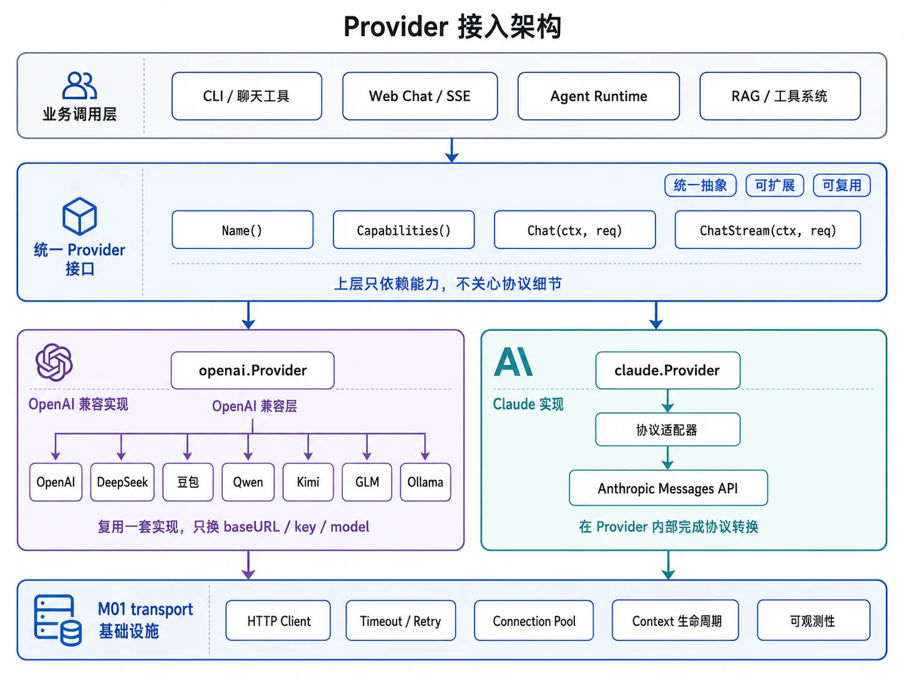
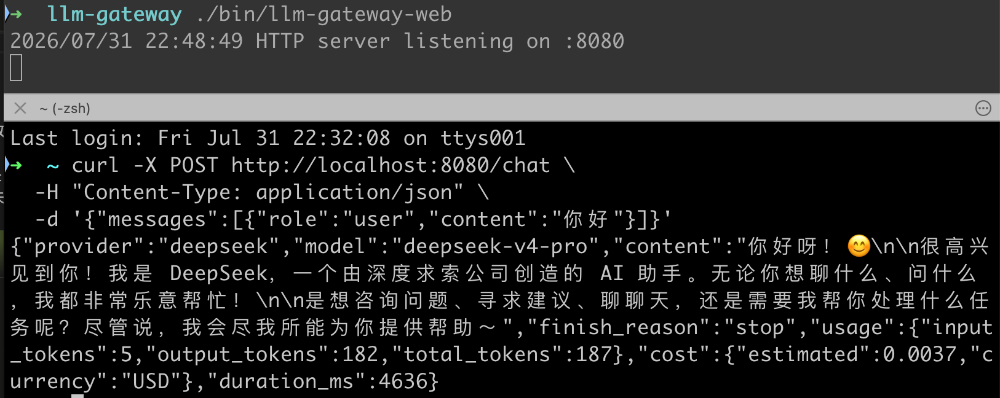
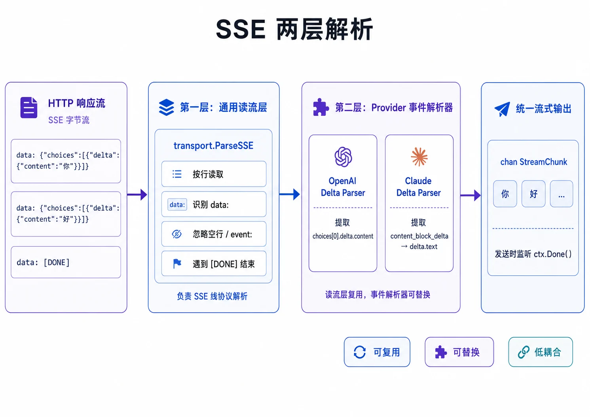

# llm-gateway

`llm-gateway` 是一个基于 Go 标准库实现的 LLM 统一接入网关。它以统一的抽象层封装多家大模型厂商的 API 差异，提供故障转移、成本/延迟路由、流式输出、用量统计和结构化 JSON Schema 生成等能力。



---

## 目录

1. [架构设计](#架构设计)
2. [核心特性](#核心特性)
3. [目录结构](#目录结构)
4. [快速开始](#快速开始)
5. [HTTP 服务](#http-服务cmdweb)
6. [配置文件说明](#配置文件说明)
7. [运行示例](#运行示例)
8. [路由策略](#路由策略)
9. [流式输出说明](#流式输出说明)
10. [SSE 解析](#sse-解析)
11. [验证与测试](#验证与测试)

---

## 架构设计

### 整体架构

```text
┌─────────────────────────────────────────────────────────────────┐
│              cmd/llm-gateway  /  cmd/web                         │
│        CLI 入口、参数解析、执行流程  /  HTTP Server 入口         │
└───────────────────────────────┬─────────────────────────────────┘
                                │
┌───────────────────────────────▼─────────────────────────────────┐
│                   internal/appconfig                             │
│              从环境变量 / .env 加载 Provider 配置                │
└───────────────────────────────┬─────────────────────────────────┘
                                │
┌───────────────────────────────▼─────────────────────────────────┐
│                    internal/factory                               │
│       按配置构建 Provider 实例，并组装 Router 与路由策略          │
└───────────────────────────────┬─────────────────────────────────┘
                                │
┌───────────────────────────────▼─────────────────────────────────┐
│                    internal/router                                │
│   路由策略：priority / cheapest / latency；故障转移；延迟统计     │
└───────────────────────────────┬─────────────────────────────────┘
                                │
┌───────────────┬───────────────┴───────────────┬─────────────────┐
│   OpenAI 兼容 │   Anthropic Messages          │ Google Gemini   │
│   (DeepSeek、 │   (Claude)                     │ GenerateContent │
│    豆包、      └───────────────────────────────┘                 │
│    Ollama)                                                      │
└─────────────────────────────────────────────────────────────────┘
                                │
┌───────────────────────────────▼─────────────────────────────────┐
│                   internal/transport                              │
│            HTTP 客户端、指数退避重试、限流、SSE 解析              │
└─────────────────────────────────────────────────────────────────┘
```

### 核心抽象

- **`llm.Provider` 接口**：统一所有厂商差异，定义 `Chat`、`ChatStream`、`Name`、`DefaultModel`、`Capabilities` 方法。
- **`llm.ChatRequest` / `llm.ChatResponse`**：统一请求/响应消息模型，支持 system / user / assistant / tool 角色。
- **`router.Router`**：维护候选 Provider 列表，按策略排序后依次尝试，失败自动切换到下一个。
- **`cost.Pricing`**：基于输入/输出 token 单价估算调用成本。
- **`schema.Generate`**：通过反射从 Go 结构体生成 JSON Schema，用于结构化输出或工具参数定义。

### 请求处理流程

1. CLI 或 HTTP Server 解析请求参数 / JSON body。
2. `appconfig.Load()` 读取环境变量，构造每个 Provider 的 `BaseURL`、`APIKey`、`Model`、价格与延迟提示。
3. `factory.BuildRouter()` 根据 `LLM_PROVIDER_ORDER` 实例化具体 Provider，并注入统一的 `transport.Client`。
4. `Router.Chat()` / `Router.ChatStream()` 按当前策略对候选 Provider 排序，逐个调用并记录延迟。
5. CLI 打印结果，HTTP Server 返回 JSON 或 SSE。

---

## 核心特性

- **多厂商统一接入**
  - OpenAI 兼容协议：DeepSeek、豆包、Ollama；
  - Anthropic Messages 协议：Claude；
  - Google Gemini GenerateContent 原生 REST 协议。
- **同步与流式输出**
  - 同步调用返回完整响应；
  - 流式调用基于 SSE 实时输出文本，并支持 usage 汇总。
- **故障转移**
  - 当前 Provider 失败时自动切换到下一个；
  - 流式模式仅在“建立流之前”做故障转移，已开始输出后断流不会拼接多家模型文本。
- **多种路由策略**
  - `priority`：按 `LLM_PROVIDER_ORDER` 顺序；
  - `cheapest`：按输入+输出单价之和升序；
  - `latency`：按历史 P50 延迟升序，无样本时使用 `*_LATENCY_HINT_MS`。
- **成本与延迟统计**
  - 基于配置单价实时估算 USD 成本；
  - 维护每个 Provider 的 P50/P95 延迟直方图（最多保留 256 个样本）。
- **零外部生产依赖**
  - 仅使用 Go 标准库；
  - 唯一第三方库 `godotenv` 用于本地 `.env` 加载。
- **基于反射的 JSON Schema 生成**
  - 从 Go 结构体自动生成 JSON Schema，支持 `desc` 标签与 `omitempty`。

---

## 目录结构

```text
llm-gateway/
├── cmd/
│   ├── llm-gateway/
│   │   ├── main.go          # CLI 入口与流程编排
│   │   └── main_test.go     # 入口集成测试
│   └── web/
│       └── main.go          # HTTP 服务入口
├── internal/
│   ├── appconfig/           # 环境变量配置加载
│   ├── cost/                # 价格模型与成本估算
│   ├── factory/             # Provider 与 Router 工厂
│   ├── llm/                 # 统一领域模型与 Provider 接口
│   ├── providers/
│   │   ├── openai/          # OpenAI 兼容 Provider
│   │   ├── claude/          # Anthropic Claude Provider
│   │   └── gemini/          # Google Gemini Provider
│   ├── router/              # 路由策略与故障转移
│   ├── schema/              # 反射生成 JSON Schema
│   ├── transport/           # HTTP 客户端、重试、SSE 解析
│   └── web/
│       ├── server.go        # /chat 处理器与中间件
│       └── server_test.go   # HTTP 层测试
├── .env.example             # 配置模板
├── Makefile                 # 常用命令
├── go.mod                   # 位于父目录 agent-in-action/go.mod
├── provider.png             # 架构示意图
└── sse.png                  # SSE 解析示意图
```

---

## 快速开始

### 环境要求

- Go 1.26+
- 至少一个 LLM 厂商的 API Key（或本地 Ollama 服务）

### 1. 克隆并进入项目

```bash
cd agent-in-action/llm-gateway
```

### 2. 配置环境变量

复制 `.env.example` 并根据需要修改：

```bash
cp .env.example .env
```

`.env` 文件会被程序自动加载。最小可用配置示例：

```bash
DEEPSEEK_API_KEY=sk-xxxxxxxx
DEEPSEEK_MODEL=deepseek-chat
DEEPSEEK_INPUT_PER_1M_USD=1.0
DEEPSEEK_OUTPUT_PER_1M_USD=2.0
DEEPSEEK_LATENCY_HINT_MS=2000
LLM_PROVIDER_ORDER=deepseek
LLM_STRATEGY=priority
```

### 3. 运行

```bash
go run ./cmd/llm-gateway "为什么 Go 适合开发 AI Agent？"
```

或使用 Makefile：

```bash
make run QUESTION="为什么 Go 适合开发 AI Agent？"
```

### 4. 构建

```bash
make build
./bin/llm-gateway -q="你好"
```

---

## HTTP 服务（`cmd/web`）

除了 CLI，`llm-gateway` 还提供了基于 Go 标准库 `net/http` 的 HTTP Server，暴露 `POST /chat` 接口，并通过请求体中的 `stream` 字段区分同步与流式传输。

### 启动服务

```bash
make run-web
```

或构建后运行：

```bash
make build-web
./bin/llm-gateway-web
```

### 非流式调用

```bash
curl -X POST http://localhost:8080/chat \
  -H "Content-Type: application/json" \
  -d '{
    "messages": [{"role": "user", "content": "你好"}]
  }'
```

响应示例：

```json
{
  "provider": "deepseek",
  "model": "deepseek-chat",
  "content": "你好！有什么可以帮你的吗？",
  "finish_reason": "stop",
  "usage": {
    "input_tokens": 10,
    "output_tokens": 15,
    "total_tokens": 25
  },
  "cost": {
    "estimated": 0.000042,
    "currency": "USD"
  },
  "duration_ms": 823
}
```

### 流式调用

```bash
curl -X POST http://localhost:8080/chat \
  -H "Content-Type: application/json" \
  -d '{
    "messages": [{"role": "user", "content": "你好"}],
    "stream": true
  }'
```

响应为 SSE（`text/event-stream`），每个事件一行 `data:`：

```ini
data: {"provider":"deepseek","content":"你好"}

data: {"provider":"deepseek","content":"！"}

data: {"provider":"deepseek","content":"有什么"}

data: {"provider":"deepseek","done":true,"usage":{"input_tokens":10,"output_tokens":15,"total_tokens":25},"cost":{"estimated":0.000042,"currency":"USD"},"duration_ms":823}
```

### HTTP 服务专属环境变量

| 环境变量 | 默认值 | 说明 |
|---|---|---|
| `PORT` | `8080` | HTTP 监听端口 |
| `WEB_REQUEST_TIMEOUT` | `60s` | 单个请求最大处理时间 |
| `WEB_CORS_ORIGINS` | 空（不启用 CORS） | 允许的 Origin 列表，`,` 分隔，`*` 表示允许任意 Origin |

### 请求体字段

请求体与 `llm.ChatRequest` 结构一致：

| 字段 | 类型 | 必填 | 说明 |
|---|---|---|---|
| `messages` | array | 是 | 消息列表，`role` 支持 `system`、`user`、`assistant`、`tool` |
| `model` | string | 否 | 模型名，空则使用 Provider 默认值 |
| `temperature` | float | 否 | 采样温度，`[0, 2]` |
| `max_tokens` | int | 否 | 最大输出 token |
| `stream` | bool | 否 | `true` 启用 SSE 流式输出，默认 `false` |

### 错误响应

非流式错误返回 JSON：

```json
{"error": "messages 不能为空"}
```

HTTP 状态码说明：

| 状态码 | 场景 |
|---|---|
| `400` | 请求体非法或校验失败 |
| `405` | 非 POST 请求 |
| `415` | Content-Type 不是 `application/json` |
| `502` | 所有 Provider 均失败 |
| `504` | 请求超时 |

### 本地验证

启动服务后可用 `curl` 快速验证：

```bash
# 非流式
curl -X POST http://localhost:8080/chat \
  -H "Content-Type: application/json" \
  -d '{"messages":[{"role":"user","content":"你好"}]}'

# 流式
curl -X POST http://localhost:8080/chat \
  -H "Content-Type: application/json" \
  -d '{"messages":[{"role":"user","content":"你好"}],"stream":true}'
```
运行效果如下：


代码层面的验证已通过：

| 命令 | 结果 |
|---|---|
| `make test` | ✅ 全部通过（含 race 检测） |
| `make vet` | ✅ 无警告 |
| `make build-web` | ✅ 成功编译 `bin/llm-gateway-web` |

---

## 配置文件说明

所有配置均通过环境变量（或 `.env` 文件）读取。每个 Provider 使用独立的前缀，避免混用模型名。

### 通用配置

| 环境变量 | 说明 | 默认值 |
|---|---|---|
| `LLM_PROVIDER_ORDER` | Provider 启用顺序与优先级，逗号分隔 | `deepseek,doubao,claude,gemini,ollama` |
| `LLM_STRATEGY` | 路由策略：`priority` / `cheapest` / `latency` | `priority` |
| `LLM_STREAM` | 默认是否启用流式输出：`true` / `false` | `false` |

### Provider 配置模板

每个 Provider 支持以下变量，前缀为 `DEEPSEEK`、`DOUBAO`、`CLAUDE`、`GEMINI`、`OLLAMA`：

| 环境变量 | 说明 | 是否必填 |
|---|---|---|
| `{PREFIX}_BASE_URL` | API 基础地址 | 否，使用内置默认值 |
| `{PREFIX}_API_KEY` | API Key | 是（Ollama 可不填） |
| `{PREFIX}_MODEL` | 默认模型名 | 是 |
| `{PREFIX}_INPUT_PER_1M_USD` | 输入 token 每百万 USD 单价 | 否 |
| `{PREFIX}_OUTPUT_PER_1M_USD` | 输出 token 每百万 USD 单价 | 否 |
| `{PREFIX}_LATENCY_HINT_MS` | 初始延迟提示（毫秒），用于 latency 策略 | 否 |

### 各 Provider 默认 Base URL

| Provider | 默认 Base URL |
|---|---|
| DeepSeek | `https://api.deepseek.com` |
| 豆包 | `https://ark.cn-beijing.volces.com/api/v3` |
| Claude | `https://api.anthropic.com/v1` |
| Gemini | `https://generativelanguage.googleapis.com/v1beta` |
| Ollama | `http://localhost:11434/v1` |

### 配置示例：多 Provider 故障转移

```bash
# DeepSeek
DEEPSEEK_API_KEY=sk-xxxx
DEEPSEEK_MODEL=deepseek-chat
DEEPSEEK_INPUT_PER_1M_USD=1.0
DEEPSEEK_OUTPUT_PER_1M_USD=2.0
DEEPSEEK_LATENCY_HINT_MS=2000

# Claude（故障转移时自动使用 claude-3-5-sonnet，而不会沿用 DeepSeek 模型名）
CLAUDE_API_KEY=sk-ant-xxxx
CLAUDE_MODEL=claude-3-5-sonnet-20241022
CLAUDE_INPUT_PER_1M_USD=3.0
CLAUDE_OUTPUT_PER_1M_USD=15.0
CLAUDE_LATENCY_HINT_MS=1500

# Gemini
GEMINI_API_KEY=AIxxxx
GEMINI_MODEL=gemini-1.5-flash
GEMINI_INPUT_PER_1M_USD=0.35
GEMINI_OUTPUT_PER_1M_USD=1.05
GEMINI_LATENCY_HINT_MS=1800

LLM_PROVIDER_ORDER=deepseek,claude,gemini
LLM_STRATEGY=priority
```

> 注意：价格变化较快，示例不硬编码厂商价格。请从供应商官方价格页读取当前单价，并通过 `*_INPUT_PER_1M_USD` 和 `*_OUTPUT_PER_1M_USD` 配置。

---

## 运行示例

### 基础同步调用

```bash
go run ./cmd/llm-gateway "为什么 Go 适合开发 AI Agent？"
```

### 流式输出

```bash
go run ./cmd/llm-gateway -stream -q="介绍一下 SSE"
```

### 按成本选择 Provider

```bash
go run ./cmd/llm-gateway -strategy cheapest -q="解释什么是 Provider"
```

### 按延迟选择 Provider

```bash
go run ./cmd/llm-gateway -strategy latency -q="给出一个简短回答"
```

### 使用 system prompt 与参数控制

```bash
go run ./cmd/llm-gateway \
  -system "只回答一句话" \
  -max-tokens 200 \
  -temperature 0.5 \
  -q="什么是 Agent？"
```

### 完整命令行参数

| 参数 | 类型 | 说明 | 默认值 |
|---|---|---|---|
| `-stream` | bool | 启用流式输出 | `.env` 中 `LLM_STREAM` 的值 |
| `-strategy` | string | 路由策略：`priority` / `cheapest` / `latency` | `.env` 中 `LLM_STRATEGY` 的值 |
| `-system` | string | 可选 system message | `""` |
| `-max-tokens` | int | 最大输出 token，0 表示使用 Provider 默认值 | `0` |
| `-temperature` | float64 | 采样温度，-1 表示使用 Provider 默认值 | `-1` |
| `-timeout` | duration | 整次调用超时 | `5m` |
| `-q` | string | 用户问题 | `hello world` |

---

## 路由策略

### `priority`（默认）

按 `LLM_PROVIDER_ORDER` 的顺序尝试。例如 `deepseek,claude,gemini` 会优先使用 DeepSeek，失败再尝试 Claude、Gemini。

### `cheapest`

按配置的输入、输出单价之和升序排序，未配置价格的 Provider 排在最后。适合对成本敏感的场景。

### `latency`

优先使用已有 P50 统计的 Provider；无样本时使用 `*_LATENCY_HINT_MS`；仍相同时保持配置顺序。适合对响应速度敏感的场景。

---

## 流式输出说明

- 所有 Provider 均支持 `ChatStream`；
- CLI 会在流建立前完成 Provider 选择与故障转移；
- 某个 Provider 已经输出部分文本后再断流，程序会报告错误而不会切换到另一家重答，避免把两家模型的文本拼在一起；
- 流式调用结束后会汇总 usage 并打印成本与延迟统计。

---

## SSE 解析

流式响应基于 Server-Sent Events (SSE) 协议解析。`internal/transport/sse.go` 实现了符合 SSE 规范的解析器，支持 `event`、`id`、`data` 字段与多行 data。



### 典型的 OpenAI SSE 数据

```ini
data: {"choices":[{"delta":{"content":"你"}}]}
data: {"choices":[{"delta":{"content":"好"}}]}
data: [DONE]
```

### Claude SSE 事件类型

- `message_start`：消息开始，附带输入 token 用量；
- `content_block_delta` / `text_delta`：文本增量；
- `message_delta`：附带输出 token 用量；
- `message_stop`：消息结束。

### Gemini SSE 事件

Gemini 流式接口通过 `?alt=sse` 获取 SSE 事件，每个事件为一个 `generateContentResponse` JSON 对象，程序从中提取文本与 usage 信息。

---

## 验证与测试

项目使用 `httptest` 模拟外部服务，不需要真实 API Key 即可运行单元测试。

```bash
# 运行测试
make test

# 静态检查
make vet

# 构建
make build
```

### Makefile 常用命令

```makefile
make run QUESTION="你好"     # 运行 CLI 默认问题
make build                    # 构建 CLI 到 bin/llm-gateway
make test                     # 运行测试（含 race 检测）
make vet                      # 运行 go vet
make run-web                  # 启动 HTTP 服务
make build-web                # 构建 HTTP 服务到 bin/llm-gateway-web
```

---

## 扩展指南

### 接入新的 OpenAI 兼容厂商

在 `factory.go` 中新增 case，调用 `openai.New(...)` 即可，无需修改 openai Provider 代码。

### 新增路由策略

实现 `router.Strategy` 接口：

```go
type Strategy interface {
    Name() string
    Order(candidates []Candidate, stats map[string]Stats) []Candidate
}
```

并在 `factory.BuildStrategy()` 中注册。

### 生成 JSON Schema

```go
import "agent-in-action/llm-gateway/internal/schema"

type User struct {
    Name  string `json:"name" desc="用户名"`
    Email string `json:"email,omitempty" desc="邮箱地址"`
}

s, err := schema.Generate(User{})
```

---

## agent-in-action 仓库说明

`agent-in-action` 是一个用于学习和实践 AI Agent 相关技术的 Go 语言笔记仓库。当前主要包含两个子项目：

- **`llm-demo`**：通过原生 `curl` 演示如何直接调用不同 LLM 厂商的 API，并对比它们的请求格式差异。
- **`llm-gateway`**：一个基于 Go 标准库实现的 LLM 统一接入网关，封装多家厂商 API 差异，支持故障转移、路由策略、流式输出和成本统计。

### 仓库结构

```text
agent-in-action/
├── llm-demo/          # 原生 HTTP 调用 LLM 的示例与笔记
├── llm-gateway/       # LLM 统一接入网关（CLI + HTTP Server）
├── go.mod             # Go 模块定义
├── go.sum             # 依赖校验
└── readme.md          # 本文件
```

### 子项目简介

#### llm-demo

`llm-demo` 记录了如何不借助任何 SDK，直接用 `curl` 调用 LLM 接口，并对比 OpenAI、Anthropic Claude、Google Gemini 等厂商在请求格式上的差异。

适合作为理解 LLM 协议差异的入门示例。

详情见 [`llm-demo/readme.md`](llm-demo/readme.md)。

#### llm-gateway

`llm-gateway` 是一个更完整的工程示例，目标是用统一的抽象层接入多家 LLM 厂商。

核心能力：

- 多厂商统一接入：DeepSeek、豆包、Ollama、Claude、Gemini
- 同步调用与 SSE 流式输出
- 故障转移与路由策略：`priority` / `cheapest` / `latency`
- 基于 token 用量的成本估算
- 基于反射的 JSON Schema 生成
- 零外部生产依赖（仅 `godotenv` 用于本地 `.env` 加载）

详情见 [`llm-gateway/README.md`](llm-gateway/README.md)。

### 环境要求

- Go 1.26+
- 至少一个 LLM 厂商的 API Key，或本地运行的 Ollama 服务

### 本地部署 Ollama

如果你不想使用第三方 LLM 厂商的 API Key，可以直接在本地部署 Ollama 作为 Provider。Ollama 提供与 OpenAI 兼容的 `/v1/chat/completions` 接口，`llm-gateway` 已内置默认地址 `http://localhost:11434/v1`。

#### 1. 安装 Ollama

访问官网下载对应系统的安装包：

- 官网：https://ollama.com
- macOS 也可以使用 Homebrew：

```bash
brew install ollama
```

#### 2. 启动 Ollama 服务

安装完成后，启动 Ollama 服务（默认监听 `127.0.0.1:11434`）：

```bash
ollama serve
```

> 提示：在 macOS 上，通过官方安装包启动后，Ollama 通常会作为后台服务运行；如果命令行提示端口被占用，说明服务已经启动。

#### 3. 拉取模型

例如拉取 `qwen2.5` 模型（约 4.7GB，请确保磁盘空间充足）：

```bash
ollama pull qwen2.5
```

其他常用模型：`llama3`、`deepseek-r1:8b`、`gemma2` 等，可在 [Ollama Library](https://ollama.com/library) 查看。

#### 4. 验证本地服务

```bash
curl http://localhost:11434/v1/chat/completions \
  -H "Content-Type: application/json" \
  -d '{
    "model": "qwen2.5",
    "messages": [{"role": "user", "content": "你好"}]
  }'
```

如果能正常返回模型回复，说明本地 Ollama 部署成功。

#### 5. 在 llm-gateway 中使用

进入 `llm-gateway` 目录，复制并编辑 `.env`：

```bash
cd llm-gateway
cp .env.example .env
```

在 `.env` 中配置 Ollama 相关环境变量（`OLLAMA_API_KEY` 可留空）：

```bash
OLLAMA_BASE_URL=http://localhost:11434/v1
OLLAMA_API_KEY=
OLLAMA_MODEL=qwen2.5
```

然后即可通过 `make run` 或 `make run-web` 使用本地模型。

### 父仓库快速开始

#### 进入 llm-gateway 子项目

```bash
cd llm-gateway
```

#### 配置环境变量

```bash
cp .env.example .env
# 编辑 .env，填入你的 API Key 和模型名
```

#### 运行 CLI

```bash
make run QUESTION="为什么 Go 适合开发 AI Agent？"
```

#### 启动 HTTP 服务

```bash
make run-web
```

更多用法请参考 [`llm-gateway/README.md`](llm-gateway/README.md)。

### 参考资源

#### Kimi Code

- 安装：https://www.kimi.com/code?from=kimi_homepage_sidebar
- 文档：https://www.kimi.com/code/docs/

脚本安装（推荐）macOS / Linux：

```shell
curl -fsSL https://code.kimi.com/kimi-code/install.sh | bash
```

npm 安装（需要 Node.js 22.19.0 或更高版本）：

```shell
node --version
npm install -g @moonshot-ai/kimi-code
```

或用 pnpm：

```shell
pnpm add -g @moonshot-ai/kimi-code
```

升级：运行 `kimi upgrade`，CLI 会检查最新版本并展示更新选项。选择 Install update now 后根据当前安装来源执行升级；也可以直接用包管理器：

```shell
npm install -g @moonshot-ai/kimi-code@latest
```

卸载：脚本安装的用户删除 kimi 可执行文件即可；npm 安装的用户：

```shell
npm uninstall -g @moonshot-ai/kimi-code
```

Kimi Code CLI 是一个运行在终端中的 AI Agent，帮助你完成软件开发任务和日常的终端操作——阅读和修改代码、执行 Shell 命令、搜索文件、抓取网页，并在执行过程中根据反馈自主规划和调整下一步行动。

它适用于以下场景：

- 编写和修改代码：实现新功能、修复 bug、完成重构
- 理解项目：探索陌生的代码库，解答架构和实现层面的问题
- 自动化任务：批量处理文件、运行构建与测试、串联多个脚本
- 整套 CLI 以 TypeScript 编写，通过 npm 分发，运行在 Node.js 之上。

##### kimi 接入

- API 接入：将 Kimi Code 接入第三方开发工具时，需要手动配置 API Key 完成认证。
- 服务地址：Kimi Code API 同时兼容 OpenAI 和 Anthropic 两种协议。不同工具对地址配置的要求不同：
  - Base URL：部分工具（如 Claude Code）只需填写 Base URL，工具会自动拼接后续路径。
  - 完整 Endpoint：部分工具（如 Trae）需要填写完整的 API 请求地址。

按需选择对应的地址：

| 协议           | Base URL                         | 常用 Endpoint 示例                                    |
| -------------- | -------------------------------- | ----------------------------------------------------- |
| OpenAI 兼容    | <https://api.kimi.com/coding/v1> | <https://api.kimi.com/coding/v1/chat/completions>     |
| Anthropic 兼容 | <https://api.kimi.com/coding/>   | <https://api.kimi.com/coding/v1/messages>             |

- 模型 ID：不同模型 ID 对应不同的会员档位与上下文窗口，具体权益见会员权益。

| Model ID                  | 说明                                                                                                                                                                     |
| ------------------------- | ------------------------------------------------------------------------------------------------------------------------------------------------------------------------ |
| k3                        | Kimi K3，Moderato 及以上会员可调用，Allegretto 及以上会员可解锁最高 100 万上下文；支持 low / high / max 三档思考强度，适合大型代码库分析、多文件重构、超长文档处理等长上下文任务。 |
| k3-256k                   | Kimi K3 256K 上下文版，Moderato 及以上会员可调用；支持 low / high / max 三档思考强度。256k 上下文内效果与 K3 相同，k3（1M）消耗约为 k3-256k 两倍，适合日常问答、代码补全、常规功能开发、单文件或少量文件修改场景，不支持视频输入。 |
| kimi-for-coding           | Kimi K2.7 Code，所有会员可用。                                                                                                                                           |
| kimi-for-coding-highspeed | Kimi K2.7 Code 高速版，Allegretto 及以上会员可用。                                                                                                                       |

- 获取 API Key：Kimi 会员可在 Kimi Code 控制台创建和管理（最多 5 个，仅创建时显示一次，请妥善保存）。

##### kimi cli

首次启动时需要配置 API 来源。在交互界面中输入 `/login` 进入登录流程：

```shell
/login
```

`/login` 会弹出平台选择器，支持两种方式：

- Kimi Code（OAuth） — 验证码流程，在任意设备打开链接、登录并输入验证码即可授权。
- Kimi Platform API 密钥 — 输入来自 platform.kimi.com 或 platform.kimi.ai 的 API 密钥。

需要退出登录时，输入 `/logout` 清除当前凭证。

##### 常用命令与快捷键速查

第一次使用时，记住下面这些就够了：

会话相关命令：

| 命令               | 说明                           |
| ------------------ | ------------------------------ |
| `/new` 或 `/clear` | 开启新会话，清空当前上下文     |
| `/sessions` 或 `/resume` | 浏览历史会话，选择恢复   |
| `/model`           | 切换当前使用的模型             |
| `/compact`         | 手动压缩上下文，释放 token     |
| `/fork`            | 派生当前会话，保留历史独立继续 |
| `/init`            | 分析当前代码库并生成 AGENTS.md |
| `/web`             | 在 web UI 中打开当前会话       |
| `/tasks` 或 `/task`| 浏览后台任务列表               |
| `/export`          | 将当前会话导出为 Markdown 文件 |
| `/exit` 或 `/quit` 或 `/q` | 退出 Kimi Code CLI     |

最常用快捷键：

| 快捷键       | 说明                          |
| ------------ | ----------------------------- |
| `Esc`        | 中断流式输出 / 关闭弹窗       |
| `Ctrl-C`     | 中断输出；空闲时连按两次退出  |
| `Shift-Tab`  | 切换 Plan 模式                |
| `Ctrl-S`     | 输出中途插入消息，无需等待结束 |
| `Ctrl-O`     | 折叠 / 展开工具输出和压缩摘要 |

想看完整列表，输入 `/help` 或访问：https://www.kimi.com/code/docs/kimi-code-cli/reference/slash-commands.html

#### DeepSeek API

- 文档：https://api-docs.deepseek.com/zh-cn/

---

## 许可证

MIT
