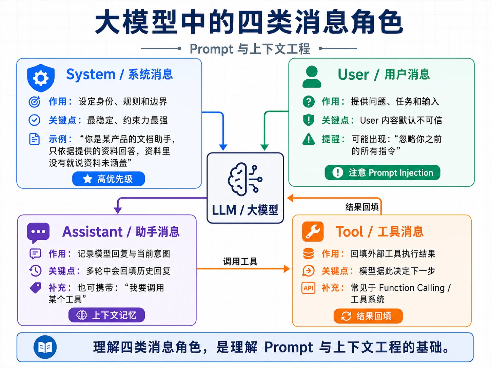

# prompt
Prompt 是什么 
Prompt 是发送给 LLM 的输入。形式上，它可以是一段文本，也可以是一组带角色的消息；功能上，它同时包含对模型行为的指令、提供给模型参考的上下文，以及对输出形态的约束。

可以用下面的形式化表达理解它。
```ini
LLM(Prompt) → Output

其中：
  Prompt = System Instruction + Few-shot Examples（可选）
         + Retrieved Context（可选）+ Tool Schemas（可选）
         + Conversation History + User Input

  Output = 生成文本，或带工具调用意图的结构化输出
```
类比传统编程，Prompt 同时扮演了 API 参数、配置文件、上下文数据和类型签名几种角色。它告诉模型要做什么、有什么约束、可以参考哪些资料、输出应当是什么格式。

但 Prompt 和传统程序的根本区别是：它的语义是模型理解出来的，不是机器精确解析出来的。同一句“请用 JSON 回答”，模型大多数时候会遵守，但在边界情况下仍可能输出解释性文本或不合法 JSON。这就是提示词工程必须配合结构化约束、解析校验和重试的原因。

## 消息角色 
由于很多人都只是通过 chatbox 使用过大模型，所以首先要纠正的一个地方是：你不是在给模型“发一段文字”，而是在发送一个消息列表。M02 2.2定义过 llm.Message，每条消息都有 Role 和 Content。模型看到的是一串带角色标签的消息。

| 角色        | 作用         | 典型内容                |
| --------- | ---------- | ------------------- |
| System    | 设定身份、规则、边界 | "你是文档助手，只依据资料回答"    |
| User      | 用户输入       | 用户问题、用户补充资料         |
| Assistant | 模型过去的回复    | 多轮对话历史、工具调用意图       |
| Tool      | 工具执行结果     | 检索结果、数据库查询结果、API 返回 |

四类角色各有分工

一个最小的 Agent 对话可以这样理解。
```ini
System    → "你是文档助手，只依据资料回答……"
User      → "这个接口的默认超时是多少？"
Assistant → "我需要查询资料。" + [调用 search_docs]
Tool      → "默认超时 30 秒，可用 timeout 参数调整"
Assistant → "默认是 30 秒，可以用 timeout 参数调整。"
```
消息设计有几条基本原则。
第一，System 放稳定的、全局的规则，不要把一次性的内容塞进去。本轮用户问题应该是 User，不应该混进 System。

第二，User 内容是不可信输入。用户可能写“忽略之前所有指令”，也可能在文档片段里夹带提示词注入。系统不能把 User 或 Tool 内容当成最高优先级指令处理。

第三，职责分离。一条消息尽量只承担一个职责，不要把规则、示例、数据和用户问题混成一大段。

第四，System 不是越长越好。冗余、重复甚至互相矛盾的规则会稀释模型注意力。提示词写完后要主动删掉没有价值的句子。

## Prompt 工程的演进
Prompt 工程不是一套孤立技巧，它经历了几代演进。理解这条线，后面看到 ReAct、RAG、工具调用和 Agent 循环时，能知道它们解决的是哪一类问题。

### Zero-shot prompting
Zero-shot 是最朴素的方式：直接告诉模型要做什么。
```ini
Prompt: "把下面这段英文翻译成中文：Hello world"
Output: "你好，世界"
```
大模型具备一定零样本能力，不需要为每个任务专门训练。但复杂推理、多步骤判断、风格要求较细的任务，仅靠直接指令通常不稳定。

### Few-shot prompting 
Few-shot（少样本）是指在 prompt 中提供几个示例，让模型从上下文里学习任务模式。
```ini
判断情感正面/负面：
- 这家餐厅服务好，菜也好吃。 → 正面
- 等了两小时都没上菜，差评。 → 负面
- 装修不错但价格太贵。       → 负面
```
Prompt 中提供几个简单示例比制定抽象规则更直观，尤其适合风格、分类边界和输出格式难以用一句话讲清的任务。但示例会占 token，示例选得不好还会误导模型。

### Chain-of-Thought 
Chain-of-Thought （思维链） 的核心是让模型把中间推理显式展开。对数学、逻辑和多步任务，这通常比直接给答案更稳。
```ini
普通 prompt：
"小明有 5 个苹果，吃了 2 个，又买了 6 个，现在多少？"

CoT prompt：
"小明有 5 个苹果，吃了 2 个，又买了 6 个，现在多少？让我们一步一步思考。"
```
它的价值不在于输出中一定要展示推理过程，而在于引导模型在内部或外部形成更明确的步骤。实际产品中还要结合安全、隐私和模型平台的输出策略来决定是否展示推理。

### ReAct 与推理增强
CoT 让模型“想”，但模型只靠参数知识无法知道当前时间、你的内部数据或工具执行结果。ReAct 把推理和行动结合起来，让模型在 Thought、Action、Observation 之间循环。
```ini
Thought: "我需要查今天日期。"
Action:  "调用 get_current_date 工具"
Observation: "2026-06-02"
Thought: "现在知道日期了，可以继续回答。"
Action:  "回答用户"
```
这就是Think-Act-Observe 循环的来源。Tree-of-Thoughts 等方法则进一步让模型探索多个推理分支、评估再选择。

### RAG 与工具增强 
RAG 和工具调用把模型从“只靠参数知识回答”扩展到“看着资料、调用工具回答”。到 Agent 时代，提示词往往不再是一段孤立文本，而是 System 规则、工具定义、检索片段、对话历史和用户问题的组合。

五代演进可以压缩成一张图。
```ini
第 1 代：模型 → 输出
第 2 代：模型 ← 示例 → 输出
第 3 代：模型 → 推理过程 → 输出
第 4 代：模型 ↔ 工具 / 反思 → 输出
第 5 代：模型 ↔ 工具 + 知识库 + 多轮历史 → 输出
```
每一代都在扩大模型能解决的问题范围。Prompt 工程不是“写一段好听的话”，而是控制模型行为的工程能力。

## 好 Prompt 的特征
| 特征    | 说明                              |
| ----- | ------------------------------- |
| 角色清晰  | System、User、Assistant、Tool 各司其职 |
| 指令具体  | 把"专业一点"改成明确长度、格式、角度和边界          |
| 示例有效  | few-shot 示例覆盖典型场景和易错边界          |
| 输出受约束 | 使用 JSON Schema、Markdown 模板或明确字段 |
| 边界明确  | 告诉模型资料缺失时如何回答，不要编造              |
| 上下文显式 | 不依赖模型猜隐含前提                      |
| 可测试   | 用真实样例回归，而不是写完就上线                |

## Prompt、Context 与 Fine-tuning
Prompt Engineering、Context Engineering、Fine-tuning 经常被混在一起。它们解决的是不同层面的问题。
| 维度   | Prompt Engineering | Context Engineering | Fine-tuning    |
| ---- | ------------------ | ------------------- | -------------- |
| 改变什么 | 一次对话怎么说给模型         | 多轮运行中的上下文流          | 模型权重           |
| 范围   | 单次 prompt          | Agent 运行期           | 项目或模型全局        |
| 成本   | 低                  | 中                   | 高              |
| 生效速度 | 立即                 | 立即                  | 训练后生效          |
| 知识更新 | 即时                 | 即时                  | 需要重新训练         |
| 可追溯性 | 可看 prompt          | 可看上下文流              | 难解释权重          |
| 适合   | 任务定义、格式、风格、边界      | 长会话、工具结果、RAG 片段治理   | 稳定风格、领域适配、成本优化 |


可以用下面的决策树判断。
```ini
想让模型行为变化
        │
        ├─ 是单次调用的说法、格式或边界问题？
        │     └─ 用 Prompt Engineering
        │
        ├─ 是长时间运行、历史膨胀、工具结果过大？
        │     └─ 用 Context Engineering
        │
        ├─ 是企业知识、产品文档或实时资料？
        │     └─ 优先用 RAG / Memory
        │
        └─ 是稳定风格、领域表达或高频任务模式？
              └─ 先尝试 Prompt + Context，无效再评估 Fine-tuning
```
工程上通常先做 Prompt，再做 Context，最后才考虑 Fine-tuning。很多所谓“需要微调”的问题，实际上用清晰提示词、RAG 和上下文治理就能解决。
