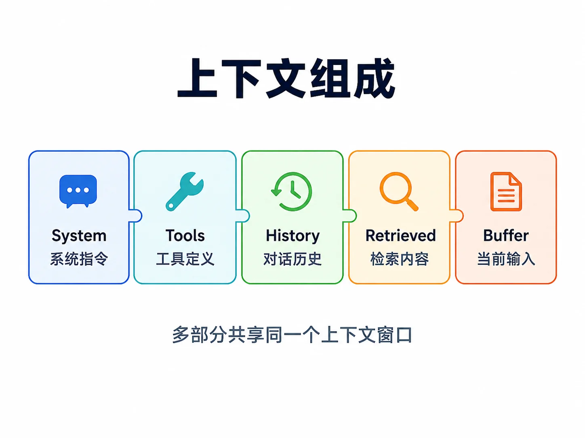
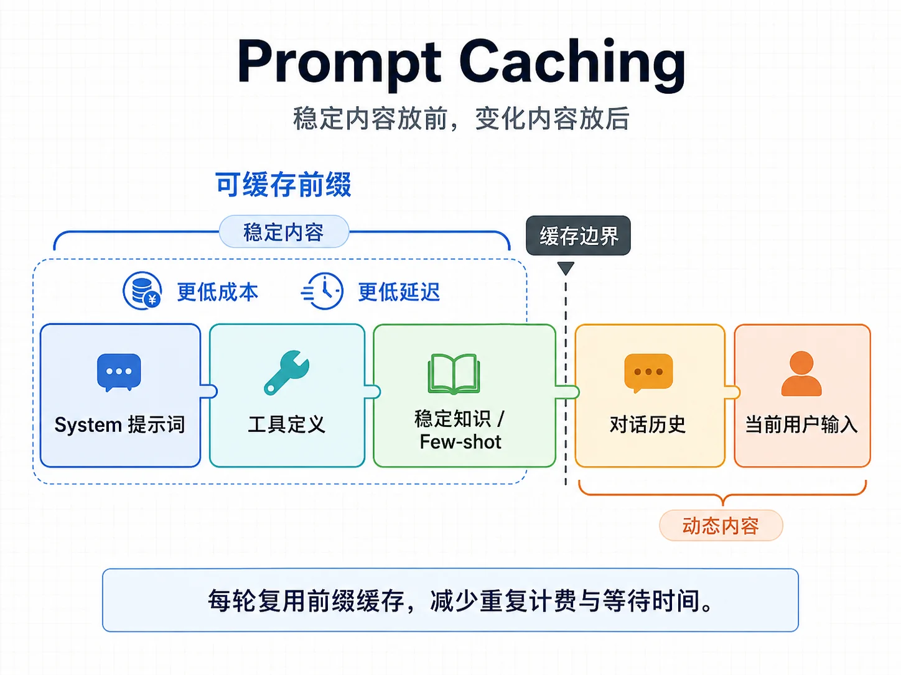

# prompt
Prompt 是什么 
Prompt 是发送给 LLM 的输入。形式上，它可以是一段文本，也可以是一组带角色的消息；功能上，它同时包含对模型行为的指令、提供给模型参考的上下文，以及对输出形态的约束。

可以用下面的形式化表达理解它。
```ini
LLM(Prompt) → Output

其中：
  Prompt = System Instruction + Few-shot Examples（可选）
         + Retrieved Context（可选）+ Tool Schemas（可选）
         + Conversation History + User Input

  Output = 生成文本，或带工具调用意图的结构化输出
```
类比传统编程，Prompt 同时扮演了 API 参数、配置文件、上下文数据和类型签名几种角色。它告诉模型要做什么、有什么约束、可以参考哪些资料、输出应当是什么格式。

但 Prompt 和传统程序的根本区别是：它的语义是模型理解出来的，不是机器精确解析出来的。同一句“请用 JSON 回答”，模型大多数时候会遵守，但在边界情况下仍可能输出解释性文本或不合法 JSON。这就是提示词工程必须配合结构化约束、解析校验和重试的原因。

## 消息角色 
由于很多人都只是通过 chatbox 使用过大模型，所以首先要纠正的一个地方是：你不是在给模型“发一段文字”，而是在发送一个消息列表。M02 2.2定义过 llm.Message，每条消息都有 Role 和 Content。模型看到的是一串带角色标签的消息。

| 角色        | 作用         | 典型内容                |
| --------- | ---------- | ------------------- |
| System    | 设定身份、规则、边界 | "你是文档助手，只依据资料回答"    |
| User      | 用户输入       | 用户问题、用户补充资料         |
| Assistant | 模型过去的回复    | 多轮对话历史、工具调用意图       |
| Tool      | 工具执行结果     | 检索结果、数据库查询结果、API 返回 |

四类角色各有分工

一个最小的 Agent 对话可以这样理解。
```ini
System    → "你是文档助手，只依据资料回答……"
User      → "这个接口的默认超时是多少？"
Assistant → "我需要查询资料。" + [调用 search_docs]
Tool      → "默认超时 30 秒，可用 timeout 参数调整"
Assistant → "默认是 30 秒，可以用 timeout 参数调整。"
```
消息设计有几条基本原则。
第一，System 放稳定的、全局的规则，不要把一次性的内容塞进去。本轮用户问题应该是 User，不应该混进 System。

第二，User 内容是不可信输入。用户可能写“忽略之前所有指令”，也可能在文档片段里夹带提示词注入。系统不能把 User 或 Tool 内容当成最高优先级指令处理。

第三，职责分离。一条消息尽量只承担一个职责，不要把规则、示例、数据和用户问题混成一大段。

第四，System 不是越长越好。冗余、重复甚至互相矛盾的规则会稀释模型注意力。提示词写完后要主动删掉没有价值的句子。

## Prompt 工程的演进
Prompt 工程不是一套孤立技巧，它经历了几代演进。理解这条线，后面看到 ReAct、RAG、工具调用和 Agent 循环时，能知道它们解决的是哪一类问题。

### Zero-shot prompting
Zero-shot 是最朴素的方式：直接告诉模型要做什么。
```ini
Prompt: "把下面这段英文翻译成中文：Hello world"
Output: "你好，世界"
```
大模型具备一定零样本能力，不需要为每个任务专门训练。但复杂推理、多步骤判断、风格要求较细的任务，仅靠直接指令通常不稳定。

### Few-shot prompting 
Few-shot（少样本）是指在 prompt 中提供几个示例，让模型从上下文里学习任务模式。
```ini
判断情感正面/负面：
- 这家餐厅服务好，菜也好吃。 → 正面
- 等了两小时都没上菜，差评。 → 负面
- 装修不错但价格太贵。       → 负面
```
Prompt 中提供几个简单示例比制定抽象规则更直观，尤其适合风格、分类边界和输出格式难以用一句话讲清的任务。但示例会占 token，示例选得不好还会误导模型。

### Chain-of-Thought 
Chain-of-Thought （思维链） 的核心是让模型把中间推理显式展开。对数学、逻辑和多步任务，这通常比直接给答案更稳。
```ini
普通 prompt：
"小明有 5 个苹果，吃了 2 个，又买了 6 个，现在多少？"

CoT prompt：
"小明有 5 个苹果，吃了 2 个，又买了 6 个，现在多少？让我们一步一步思考。"
```
它的价值不在于输出中一定要展示推理过程，而在于引导模型在内部或外部形成更明确的步骤。实际产品中还要结合安全、隐私和模型平台的输出策略来决定是否展示推理。

### ReAct 与推理增强
CoT 让模型“想”，但模型只靠参数知识无法知道当前时间、你的内部数据或工具执行结果。ReAct 把推理和行动结合起来，让模型在 Thought、Action、Observation 之间循环。
```ini
Thought: "我需要查今天日期。"
Action:  "调用 get_current_date 工具"
Observation: "2026-06-02"
Thought: "现在知道日期了，可以继续回答。"
Action:  "回答用户"
```
这就是Think-Act-Observe 循环的来源。Tree-of-Thoughts 等方法则进一步让模型探索多个推理分支、评估再选择。

### RAG 与工具增强 
RAG 和工具调用把模型从“只靠参数知识回答”扩展到“看着资料、调用工具回答”。到 Agent 时代，提示词往往不再是一段孤立文本，而是 System 规则、工具定义、检索片段、对话历史和用户问题的组合。

五代演进可以压缩成一张图。
```ini
第 1 代：模型 → 输出
第 2 代：模型 ← 示例 → 输出
第 3 代：模型 → 推理过程 → 输出
第 4 代：模型 ↔ 工具 / 反思 → 输出
第 5 代：模型 ↔ 工具 + 知识库 + 多轮历史 → 输出
```
每一代都在扩大模型能解决的问题范围。Prompt 工程不是“写一段好听的话”，而是控制模型行为的工程能力。

## 好 Prompt 的特征
| 特征    | 说明                              |
| ----- | ------------------------------- |
| 角色清晰  | System、User、Assistant、Tool 各司其职 |
| 指令具体  | 把"专业一点"改成明确长度、格式、角度和边界          |
| 示例有效  | few-shot 示例覆盖典型场景和易错边界          |
| 输出受约束 | 使用 JSON Schema、Markdown 模板或明确字段 |
| 边界明确  | 告诉模型资料缺失时如何回答，不要编造              |
| 上下文显式 | 不依赖模型猜隐含前提                      |
| 可测试   | 用真实样例回归，而不是写完就上线                |

反过来，新手常见错误也很固定。
| 错误         | 例子                  | 改法                      |
| ---------- | ------------------- | ----------------------- |
| 指令抽象       | "用专业语气回答"           | "用工程师交流时的中性语气，避免感叹号"    |
| System 堆太多 | "友好、准确、简洁、专业、同理心……" | 只保留最重要的 2-3 条，用示例补足风格   |
| 没有边界       | 只说该做什么              | 加上"资料没有时说资料未涵盖"         |
| 让模型猜格式     | "把答案给我"             | 给出 JSON 字段或 Markdown 模板 |
| 不做回归       | 写完一次就上线             | 准备真实样例集，修改 prompt 后重复验证 |

## Prompt、Context 与 Fine-tuning
Prompt Engineering、Context Engineering、Fine-tuning 经常被混在一起。它们解决的是不同层面的问题。
| 维度   | Prompt Engineering | Context Engineering | Fine-tuning    |
| ---- | ------------------ | ------------------- | -------------- |
| 改变什么 | 一次对话怎么说给模型         | 多轮运行中的上下文流          | 模型权重           |
| 范围   | 单次 prompt          | Agent 运行期           | 项目或模型全局        |
| 成本   | 低                  | 中                   | 高              |
| 生效速度 | 立即                 | 立即                  | 训练后生效          |
| 知识更新 | 即时                 | 即时                  | 需要重新训练         |
| 可追溯性 | 可看 prompt          | 可看上下文流              | 难解释权重          |
| 适合   | 任务定义、格式、风格、边界      | 长会话、工具结果、RAG 片段治理   | 稳定风格、领域适配、成本优化 |


可以用下面的决策树判断。
```ini
想让模型行为变化
        │
        ├─ 是单次调用的说法、格式或边界问题？
        │     └─ 用 Prompt Engineering
        │
        ├─ 是长时间运行、历史膨胀、工具结果过大？
        │     └─ 用 Context Engineering
        │
        ├─ 是企业知识、产品文档或实时资料？
        │     └─ 优先用 RAG / Memory
        │
        └─ 是稳定风格、领域表达或高频任务模式？
              └─ 先尝试 Prompt + Context，无效再评估 Fine-tuning
```
工程上通常先做 Prompt，再做 Context，最后才考虑 Fine-tuning。很多所谓“需要微调”的问题，实际上用清晰提示词、RAG 和上下文治理就能解决。

## Prompt 编写方法
提示词工程不是玄学，核心就是三件事：指令清晰、给好例子、约束输出格式。

好的输入才会得到好的输出，垃圾的输入只能得到垃圾的输出。

### 清晰指令 
比如，“帮我分析一下”就不是一个好的指令，因为没有说明分析目标、长度、角度和输出形式。“用三句话总结这段投诉的核心诉求，并指出用户最希望得到什么补偿”就更可执行。

写指令时，尽量把模糊形容词换成动作和产出。例如不要只写“简洁”，而是写“最多 5 条 bullet，每条不超过 30 字”；不要只写“专业”，而是写“使用工程师交流时的中性、客观语气”。

### Few-shot 示例 
当你很难用规则描述想要的风格、边界或分类标准时，给几个代表性示例通常更有效。示例不需要多，但要覆盖典型输入、边界输入和容易误判的输入。

示例也要有顺序意识。离当前任务更近的示例，对模型影响通常更大；冗余或互相矛盾的示例会污染上下文。

### 结构化输出 
如果下游程序要解析模型输出，不要只说“返回 JSON”。要给出字段、类型、含义和约束。M02 2.8的 schema.Generate 就是为这个场景准备的。

例如可以要求“只返回 JSON，不要添加解释文字”，并固定字段为 level 与 reason，其中 level 只能取 low | medium | high，reason 用一句话说明判断依据。

有原生结构化输出能力的平台，优先使用原生能力；没有时，仍要在提示词中给出结构，并在代码里做解析失败重试。

## 提示词模板 
提示词不应该通过字符串拼接来维护。规则、资料、示例、变量混在字符串拼接里，容易出错，也很难测试。Go 标准库的 text/template 足够支撑大部分提示词模板。

```go
package prompt

import (
	"bytes"
	"text/template"
)

type Template struct {
	tmpl *template.Template
}

// New 创建一个模版实例
func New(name, text string) (*Template, error) {
	// missingkey=error：引用了未提供的变量时直接报错，而不是静默渲染成 <no value>。
	t, err := template.New(name).Option("missingkey=error").Parse(text)
	if err != nil {
		return nil, err
	}
	return &Template{tmpl: t}, nil
}

// Render 模版渲染
func (t *Template) Render(data any) (string, error) {
	var buf bytes.Buffer
	if err := t.tmpl.Execute(&buf, data); err != nil {
		return "", err
	}
	return buf.String(), nil
}
```
用它构造一个文档助手的系统提示词。
```go
const docAssistantTmpl = `你是 {{.Product}} 的文档助手。

规则：
- 只依据下方「资料」回答，不编造；资料里没有就明确说"资料未涵盖"。
- 回答简洁、准确，涉及操作时给出清晰步骤。

资料：
{{range .Docs}}- {{.}}
{{end}}
示例（学习这种语气和结构）：
用户：如何修改默认超时？
助手：在配置文件里设置 timeout 字段即可，单位为秒，默认 30。需要我给出完整示例吗？`

tmpl, _ := prompt.New("doc", docAssistantTmpl)
sys, _ := tmpl.Render(map[string]any{
	"Product": "示例网关",
	"Docs":    []string{"timeout 默认 30 秒", "支持 YAML / 环境变量两种配置方式"},
})
// sys 可作为 System 消息
```
上面代码中的 missingkey=error 很重要。提示词变量缺失时，如果静默渲染成 <no value>，模型行为会变得很难排查。模板渲染阶段就报错，能把问题尽早暴露。

## 上下文窗口与 Token
要管好上下文，先要理解它的物理约束。模型一次能处理的文本量有上限，叫上下文窗口，单位是 token。输入和输出共同占用窗口，也都会影响成本和延迟。

大模型支持的上下文窗口越来越大，不代表可以把所有内容都塞进去。我们应该建立准确的心智：上下文不是仓库，而是工作台。工作台上应该摆当前任务最需要的材料，而不是把整个仓库都搬上来。

长上下文会带来两类问题。

第一，注意力被稀释。上下文越长，关键信息越可能被无关内容淹没。模型对中间位置的信息利用也可能不稳定。

第二，成本和延迟上升。每个输入 token 都要处理，输出 token 通常更贵。把大段历史、工具结果和检索片段每轮都带上，会快速增加成本。

一次模型调用的上下文通常由这些部分组成。
```ini
一次模型调用的上下文 =
   System 提示词（角色/规则）
 + 工具定义（每个工具的名字、描述、Schema）
 + 对话历史（过往消息、工具调用与结果）
 + 检索到的知识片段（RAG）
 + 当前用户输入
 ```
 
 估算 token 不需要一开始就做的很精确，有一个大概量级感更重要。下面是一个够用的粗略估算函数。
 ```go
 // 一个够用的粗略估算：英文约 4 字符/token，中文约 1.5~2 字符/token。
func estimateTokens(s string) int {
	ascii, cjk := 0, 0
	for _, r := range s {
		if r < 128 {
			ascii++
		} else {
			cjk++
		}
	}
	return ascii/4 + cjk*2/3 + 1
}
```
这个函数只用于建立预算意识。真实工程中，不同模型 tokenizer 不同，本地估算只能作为守门参考；最终计费和精确 token 数应以 Provider 返回的 usage 或平台 tokenizer 为准。

## Token 预算
有了“注意力预算”的心智，下一步是把它变成可操作的编码规则：给上下文的每一部分划定预算上限。
```go
// Budget 描述一次调用里各部分的 token 预算上限。
type Budget struct {
	Total        int // 可用窗口，已预留输出余量
	SystemPrompt int // 系统提示词
	Tools        int // 工具定义
	History      int // 对话历史
	Retrieved    int // 检索片段
}

// 例：8K 可用窗口的一种分配。
var demo = Budget{
	Total:        8000,
	SystemPrompt: 800,
	Tools:        1200,
	History:      3000,
	Retrieved:    2500,
}
```

预算的意义不在数字多精确，而在强制你为每部分划界。没有预算意识的 Agent，会把历史、工具结果、检索片段一路堆到爆窗口；有预算意识的 Agent，会在历史超标时压缩，在检索片段过多时 rerank 或减少 top-k，在工具定义过多时动态裁剪。

这里要区分两类预算。

- 本文讲的是单次调用的上下文预算：一次请求里各部分摆多少。
- 一次任务最多跑几步、累计消耗多少 token、何时停止。

前者负责“每次喂给模型什么”，后者负责“整个任务别失控”。

## Prompt Caching
上下文里有一大块内容通常每次调用都差不多：System 提示词、工具定义、结构化输出 Schema、few-shot 示例、稳定资料摘要。Prompt Caching 的基本思路，就是让这些重复前缀在后续请求中更快、更便宜地被处理。

不同平台对 Prompt Caching 的触发方式、缓存时长和价格策略不同，具体以官方文档为准。但工程原则基本一致：缓存命中依赖稳定前缀。
```ini
[System 提示词]        ← 最稳定，放最前
[工具定义]             ← 较稳定
[稳定知识 / few-shot]   ← 较稳定
────────────────────
[对话历史]              ← 每轮变化，放后面
[当前用户输入]          ← 每次都变，放最后
```

如果在 System 最前面插一个每次变化的时间戳，例如 当前时间：2026-06-02 10:30:01，前缀从开头就不同，后面的稳定内容也很难命中缓存。动态信息应该尽量放到后面，并和稳定指令分开。

Prompt Caching 主要省的是成本和延迟，不是上下文本身的 token 数。即使命中缓存，模型仍然要在本次调用中处理上下文语义。要减少上下文占用，还需要历史压缩、工具结果外置和动态工具暴露等手段。

## 上下文工程全景
本文建立的是上下文工程的基础心智：消息设计、提示词模板、注意力预算、token 预算和缓存顺序。真实平台跑起来后，上下文会以各种方式膨胀，需要主动治理。
| 手段             | 作用                    |
| -------------- | --------------------- |
| 历史压缩           | 长对话逼近窗口时，把较早内容总结成摘要   |
| Tool Result 压缩 | 工具或检索返回大段结果时，只保留要点    |
| 文件系统作外部记忆      | 大块内容外置到文件，上下文只留摘要和引用  |
| 动态工具暴露         | 按当前任务只暴露相关工具，治理工具定义膨胀 |
| 结构化笔记          | 把关键状态写入外部笔记，下一轮快速恢复   |
| 子 Agent 隔离     | 把复杂子任务交给隔离上下文的子 Agent |
| Citations      | 引用源文档而不是重新生成原文        |

这些手段的共同原则是：常驻上下文里只放当前任务必需的、结论性的内容；过程性的、可按需取回的内容放到外部。

