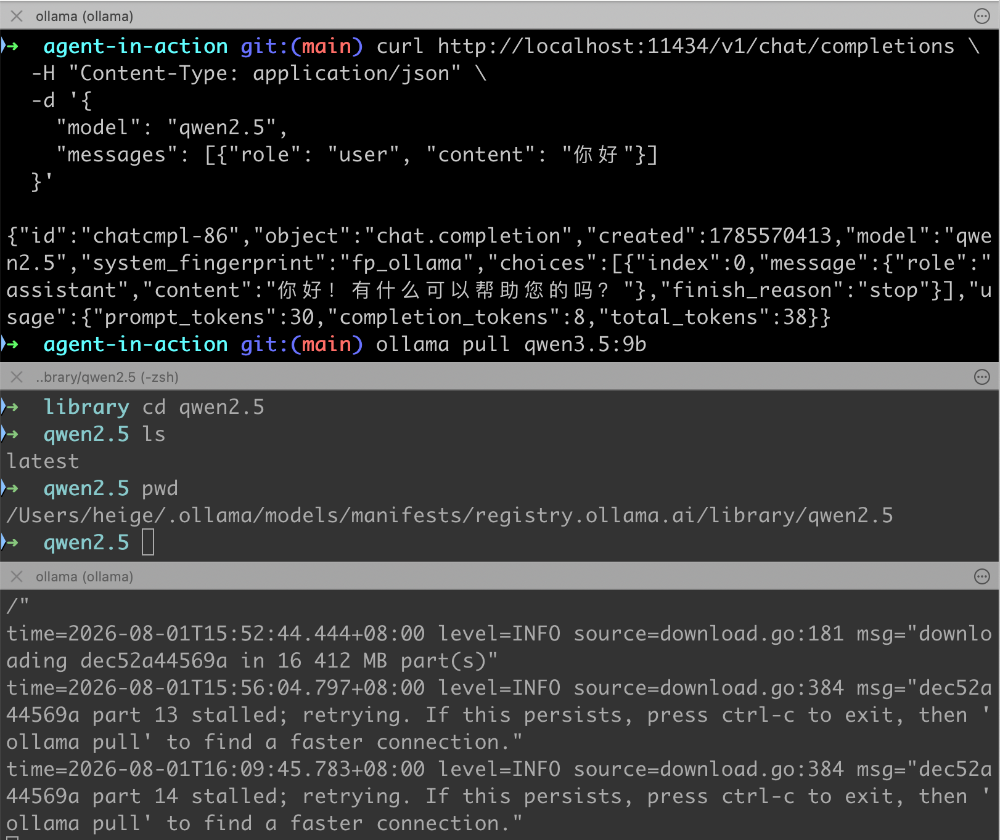

# agent-in-action

`agent-in-action` 是一个用于学习和实践 AI Agent 相关技术的 Go 语言笔记仓库。当前主要包含三个子项目：

- **`llm-demo`**：通过原生 `curl` 演示如何直接调用不同 LLM 厂商的 API，并对比它们的请求格式差异。
- **`llm-gateway`**：一个基于 Go 标准库实现的 LLM 统一接入网关，封装多家厂商 API 差异，支持故障转移、路由策略、流式输出和成本统计。
- **`prompt`**：Prompt 工程与上下文工程笔记，覆盖消息角色设计、Few-shot / CoT / ReAct / RAG 演进、提示词模板、Token 预算与 Prompt Caching 等内容。

---

## 仓库结构

```text
agent-in-action/
├── llm-demo/          # 原生 HTTP 调用 LLM 的示例与笔记
├── llm-gateway/       # LLM 统一接入网关（CLI + HTTP Server）
├── prompt/            # Prompt 工程与上下文工程笔记
├── go.mod             # Go 模块定义
├── go.sum             # 依赖校验
└── readme.md          # 本文件
```

---

## 子项目简介

### llm-demo

`llm-demo` 记录了如何不借助任何 SDK，直接用 `curl` 调用 LLM 接口，并对比 OpenAI、Anthropic Claude、Google Gemini 等厂商在请求格式上的差异。

适合作为理解 LLM 协议差异的入门示例。

详情见 [`llm-demo/readme.md`](llm-demo/readme.md)。

### llm-gateway

`llm-gateway` 是一个更完整的工程示例，目标是用统一的抽象层接入多家 LLM 厂商。

核心能力：

- 多厂商统一接入：DeepSeek、豆包、Ollama、Claude、Gemini
- 同步调用与 SSE 流式输出
- 故障转移与路由策略：`priority` / `cheapest` / `latency`
- 基于 token 用量的成本估算
- 基于反射的 JSON Schema 生成
- 零外部生产依赖（仅 `godotenv` 用于本地 `.env` 加载）

详情见 [`llm-gateway/README.md`](llm-gateway/README.md)。

## prompt

`prompt` 是一份面向工程实践的 Prompt 工程笔记，帮助理解如何设计、组织和约束发给 LLM 的输入，以及如何在 Agent 运行期治理上下文。

核心内容：

- 消息角色与职责分离：System / User / Assistant / Tool
- Prompt 工程演进：Zero-shot、Few-shot、Chain-of-Thought、ReAct、RAG
- 好 Prompt 的特征与常见反模式
- Prompt Engineering vs Context Engineering vs Fine-tuning 的决策树
- 使用 Go 标准库 `text/template` 维护提示词模板
- 上下文窗口、Token 估算与 Token 预算分配
- Prompt Caching 的排列原则与上下文工程治理手段

详情见 [`prompt/readme.md`](prompt/readme.md)。

---

## 环境要求

- Go 1.26+
- 至少一个 LLM 厂商的 API Key，或本地运行的 Ollama 服务

---

## 本地部署 Ollama

如果你不想使用第三方 LLM 厂商的 API Key，可以直接在本地部署 Ollama 作为 Provider。Ollama 提供与 OpenAI 兼容的 `/v1/chat/completions` 接口，`llm-gateway` 已内置默认地址 `http://localhost:11434/v1`。

### 1. 安装 Ollama

访问官网下载对应系统的安装包：

- 官网：https://ollama.com
- macOS 也可以使用 Homebrew：

```bash
brew install ollama
```

### 2. 启动 Ollama 服务

安装完成后，启动 Ollama 服务（默认监听 `127.0.0.1:11434`）：

```bash
ollama serve
```

> 提示：在 macOS 上，通过官方安装包启动后，Ollama 通常会作为后台服务运行；如果命令行提示端口被占用，说明服务已经启动。

### 3. 拉取模型

例如拉取 `qwen2.5` 模型（约 4.7GB，请确保磁盘空间充足）：

```bash
ollama pull qwen2.5
```

其他常用模型：`llama3`、`deepseek-r1:8b`、`gemma2`、`qwen3.5:9b` 等，可在 [Ollama Library](https://ollama.com/library) 查看。

### qwen3.5:9b
获取 qwen3.5:9b模型：https://ollama.com/library/qwen3.5
```shell
ollama pull qwen3.5:9b
```
qwen3.5:9b 在 Ollama 上默认是 Q4 量化版，模型文件约 6 GB。内存需求如下：
| 场景               | 需求                                |
| ---------------- | --------------------------------- |
| 最低可跑（Q4，默认上下文）   | **8 GB 显存**，或 8–10 GB 系统内存（纯 CPU） |
| 舒适体验（Q4，长上下文/多轮） | 10–12 GB 显存                       |
| Q8 量化（质量更好）      | 模型约 10 GB，建议 12–16 GB 显存          |

几个说明：
- 显存不够会自动用内存补：Ollama 会把放不下的层卸载到 CPU 内存，能跑但速度明显下降。比如 6 GB 显存的卡跑 9B，大约一半在显卡一半在内存。
- 上下文长度影响大：Ollama 默认上下文 4K 没问题；如果你调大 num_ctx（Qwen3.5 原生支持 256K），KV cache 会额外吃掉几个 GB。可以设环境变量 OLLAMA_KV_CACHE_TYPE=q8_0 把 KV 缓存占用减半。
- 跑 RAG 的话再加一点：embedding 模型（nomic-embed-text ~270MB / bge-m3 ~1.2GB）会同时驻留内存，建议在此基础上多留 1–2 GB。

一句话：8 GB 显存的显卡（如 RTX 4060/3070）跑 qwen3.5:9b 是正好的档位；只有 16 GB 内存、没有独显的笔记本也能跑，速度大概是每秒十几个 token。

### qwen3.5:4b
qwen3.5:4b（也就是 ollama run qwen3.5 默认拉取的档位）Q4 量化后模型文件约 3 GB。
| 场景             | 需求                               |
| -------------- | -------------------------------- |
| 最低可跑（Q4，默认上下文） | **6 GB 显存**，或 6–8 GB 系统内存（纯 CPU） |
| 舒适体验（Q4，长上下文）  | 8 GB 显存左右                        |
| Q8 量化          | 模型约 5 GB，建议 8 GB 显存              |

说明：
- 门槛很低：8 GB 内存、没有独显的轻薄本就能跑起来，CPU 推理速度也还可用
- KV cache 开销比 9B 小：调大上下文时显存增长更温和，16 GB 显存的卡跑 Q8 + 长上下文都很宽裕
- 跑 RAG 再加 1 GB 左右：留给 embedding 模型（如 nomic-embed-text）

和 9B 对比一下选择：
|      | qwen3.5:4b    | qwen3.5:9b       |
| ---- | ------------- | ---------------- |
| 模型文件 | ~3 GB         | ~6 GB            |
| 最低显存 | 6 GB          | 8 GB             |
| 适合   | 轻薄本、日常问答、简单代码 | 有 8GB+ 显卡、追求更好质量 |

简单说：有 8 GB 以上显存就直接上 9b，质量明显更好；只有核显/轻薄本就 4b，够用且流畅。

ollama pull 下载的模型存在 Ollama 的模型目录里，路径因操作系统而异
| 系统        | 默认路径                                 |
| --------- | ------------------------------------ |
| Windows   | `C:\Users\<用户名>\.ollama\models`      |
| macOS     | `~/.ollama/models`                   |
| Linux     | `/usr/share/ollama/.ollama/models`   |
| Docker 容器 | `/root/.ollama/models`（如果挂载了卷则在挂载位置） |

.ollama 内部结构：
```ini
.ollama/models/
├── manifests/          # 模型清单（记录标签、层信息）
│   └── registry.ollama.ai/library/qwen3.5/9b
└── blobs/              # 实际的模型权重文件（大文件都在这里）
    └── sha256-xxxxx...
```
例如：上面的qwen2.5放在`/.ollama/models/manifests/registry.ollama.ai/library/qwen2.5` 目录中

几点实用说明：
- 实际占空间的是 blobs/ 目录：qwen3.5:9b 那 ~6 GB 主要是一个以 sha256- 开头的 blob 文件。不同模型如果共享某些层，blob 是去重存储的，不会重复占空间。
- 想换存储位置（比如 C 盘不够大，挪到 D 盘）：设置环境变量 OLLAMA_MODELS
  - Windows：系统环境变量添加 OLLAMA_MODELS=D:\ollama\models，然后重启 Ollama
  - Linux/macOS：export OLLAMA_MODELS=/data/ollama/models（写进 shell 配置或 systemd service 的 Environment=）
- 已下载的模型直接剪切整个 models 文件夹过去即可，不用重新拉取
- 查看已下载模型：ollama list 会列出名称、大小、修改时间；ollama show qwen3.5:9b 看详情
- 删除模型释放空间：ollama rm qwen3.5:9b

### 4. 验证本地服务
请求之前，先确保 `ollama serve` 已运行。下面是请求 `qwen2.5` 的示例：
```bash
curl http://localhost:11434/v1/chat/completions \
  -H "Content-Type: application/json" \
  -d '{
    "model": "qwen2.5",
    "messages": [{"role": "user", "content": "你好"}]
  }'
```

如果能正常返回模型回复，说明本地 Ollama 部署成功。

上面的 ollama 运行效果如下图：


### 5. 在 llm-gateway 中使用

进入 `llm-gateway` 目录，复制并编辑 `.env`：

```bash
cd llm-gateway
cp .env.example .env
```

在 `.env` 中配置 Ollama 相关环境变量（`OLLAMA_API_KEY` 可留空）：

```bash
OLLAMA_BASE_URL=http://localhost:11434/v1
OLLAMA_API_KEY=
OLLAMA_MODEL=qwen2.5
```

然后即可通过 `make run` 或 `make run-web` 使用本地模型。

---

## 快速开始

### 进入 llm-gateway 子项目

```bash
cd llm-gateway
```

### 配置环境变量

```bash
cp .env.example .env
# 编辑 .env，填入你的 API Key 和模型名
```

### 运行 CLI

```bash
make run QUESTION="为什么 Go 适合开发 AI Agent？"
```

### 启动 HTTP 服务

```bash
make run-web
```

更多用法请参考 [`llm-gateway/README.md`](llm-gateway/README.md)。

---

## 参考资源

### Kimi Code

- 安装：https://www.kimi.com/code?from=kimi_homepage_sidebar
- 文档：https://www.kimi.com/code/docs/

脚本安装（推荐）macOS / Linux：
```shell
curl -fsSL https://code.kimi.com/kimi-code/install.sh | bash
```
npm 安装（需要 Node.js 22.19.0 或更高版本）
```shell
node --version
npm install -g @moonshot-ai/kimi-code
```
或用 pnpm：
```shell
pnpm add -g @moonshot-ai/kimi-code
```
升级：运行 `kimi upgrade`，CLI 会检查最新版本并展示更新选项。选择 Install update now 后根据当前安装来源执行升级；也可以直接用包管理器：
```shell
npm install -g @moonshot-ai/kimi-code@latest
```
卸载：脚本安装的用户删除 kimi 可执行文件即可；npm 安装的用户：
```shell
npm uninstall -g @moonshot-ai/kimi-code
```

Kimi Code CLI 是一个运行在终端中的 AI Agent，帮助你完成软件开发任务和日常的终端操作——阅读和修改代码、执行 Shell 命令、搜索文件、抓取网页，并在执行过程中根据反馈自主规划和调整下一步行动。

它适用于以下场景：

- 编写和修改代码：实现新功能、修复 bug、完成重构
- 理解项目：探索陌生的代码库，解答架构和实现层面的问题
- 自动化任务：批量处理文件、运行构建与测试、串联多个脚本
- 整套 CLI 以 TypeScript 编写，通过 npm 分发，运行在 Node.js 之上。

#### kimi 接入
- API 接入：将 Kimi Code 接入第三方开发工具时，需要手动配置 API Key 完成认证。
- 服务地址：Kimi Code API 同时兼容 OpenAI 和 Anthropic 两种协议。不同工具对地址配置的要求不同：
    - Base URL：部分工具（如 Claude Code）只需填写 Base URL，工具会自动拼接后续路径。
    - 完整 Endpoint：部分工具（如 Trae）需要填写完整的 API 请求地址。

按需选择对应的地址：
| 协议           | Base URL                         | 常用 Endpoint 示例                                    |
| ------------ | -------------------------------- | ------------------------------------------------- |
| OpenAI 兼容    | <https://api.kimi.com/coding/v1> | <https://api.kimi.com/coding/v1/chat/completions> |
| Anthropic 兼容 | <https://api.kimi.com/coding/>   | <https://api.kimi.com/coding/v1/messages>         |

- 模型 ID：不同模型 ID 对应不同的会员档位与上下文窗口，具体权益见 会员权益。

| Model ID                  | 说明                                                                                                                                              |
| ------------------------- | ----------------------------------------------------------------------------------------------------------------------------------------------- |
| k3                        | Kimi K3，Moderato 及以上会员可调用，Allegretto 及以上会员可解锁最高 100 万上下文；支持 low / high / max 三档思考强度，适合大型代码库分析、多文件重构、超长文档处理等长上下文任务。                              |
| k3-256k                   | Kimi K3 256K 上下文版，Moderato 及以上会员可调用；支持 low / high / max 三档思考强度。256k 上下文内效果与 K3 相同，k3（1M）消耗约为 k3-256k 两倍，适合日常问答、代码补全、常规功能开发、单文件或少量文件修场景，不支持视频输入。 |
| kimi-for-coding           | Kimi K2.7 Code，所有会员可用。                                                                                                                          |
| kimi-for-coding-highspeed | Kimi K2.7 Code 高速版，Allegretto 及以上会员可用。                                                                                                          |
- 获取 API Key：Kimi 会员可在 Kimi Code 控制台 创建和管理（最多 5 个，仅创建时显示一次，请妥善保存）

## kimi cli
首次启动时需要配置 API 来源。在交互界面中输入 /login 进入登录流程
```shell
/login
```
/login 会弹出平台选择器，支持两种方式：
- Kimi Code（OAuth） — 验证码流程，在任意设备打开链接、登录并输入验证码即可授权
- Kimi Platform API 密钥 — 输入来自 platform.kimi.com 或 platform.kimi.ai 的 API 密钥
- 需要退出登录时，输入 /logout 清除当前凭证。

### 常用命令与快捷键速查
第一次使用时，记住下面这些就够了：

会话相关命令
| 命令        | 说明               |
| --------- | ---------------- |
| /new 或 /clear     | 开启新会话，清空当前上下文    |
| /sessions 或 /resume | 浏览历史会话，选择恢复      |
| /model    | 切换当前使用的模型        |
| /compact  | 手动压缩上下文，释放 token |
| /fork     | 派生当前会话，保留历史独立继续  |
| /init     | 分析当前代码库并生成 AGENTS.md |
| /web      | 在 web UI 中打开当前会话：选择一个运行中的实例进行连接，或在 TUI 退出后新开一个前台服务器。参见 kimi web：https://www.kimi.com/code/docs/kimi-code-cli/reference/kimi-command.html#kimi-web |
| fork        | 基于当前会话 fork 一份新会话，保留完整对话历史 |
| /tasks 或 /task    |     浏览后台任务列表    |
| /export    | 将当前会话导出为 Markdown 文件 |
| /exit    或 /quit 或 /q    | 退出 Kimi Code CLI    |

最常用快捷键
| 快捷键       | 说明               |
| --------- | ---------------- |
| Esc       | 中断流式输出 / 关闭弹窗    |
| Ctrl-C    | 中断输出；空闲时连按两次退出   |
| Shift-Tab | 切换 Plan 模式       |
| Ctrl-S    | 输出中途插入消息，无需等待结束  |
| Ctrl-O    | 折叠 / 展开工具输出和压缩摘要 |

想看完整列表，输入 /help 或访问：https://www.kimi.com/code/docs/kimi-code-cli/reference/slash-commands.html

## DeepSeek API

- 文档：https://api-docs.deepseek.com/zh-cn/

## ollama 本地知识库搭建
Ollama 本身只负责跑模型，没有内置的知识库（RAG）功能，需要在它外面套一层检索增强工具。常用的三条路。
- 方案一：Anything-LLM（最简单，纯图形界面，推荐新手）

例如：免费开源桌面应用，专为"文档问答"场景设计
1. 下载安装 Anything-LLM 桌面版
2. 新建 Workspace（工作区），把 PDF / Word / Markdown / TXT 等文档拖进去，它会自动切分、向量化
3. 在设置里选 LLM Provider 为 Ollama（它会自动发现本地已 pull 的模型，比如 qwen3.5:9b）
4. Embedding 模型也可以用 Ollama 跑，建议拉一个。
```shell
ollama pull nomic-embed-text
```
然后直接在对话窗口里问，它就只基于你的文档回答。无需写任何代码。

- 方案二：Open WebUI（体验更像 ChatGPT，支持联网+知识库）
```shell
docker run -d -p 3000:8080 \
  -e OLLAMA_BASE_URL=http://host.docker.internal:11434 \
  -v open-webui:/app/backend/data \
  --name open-webui ghcr.io/open-webui/open-webui:main
```
打开 http://localhost:3000 后：

1. 临时用：对话里输入 # 上传文件，单次会话内基于文件问答
2. 长期知识库：后台 → Workspace → Knowledge 新建知识库，上传一批文档，对话时用 #知识库名 引用
3. Embedding 同样建议用 Ollama 的 nomic-embed-text 或 bge-m3（中文效果好）

- 方案三：自己写脚本（最灵活，几行代码）用 Ollama 的 embedding 接口 + 简单检索，Python 核心逻辑：
```python
import ollama

# 1. 文档切块后算向量（一次性，可缓存）
def embed(text):
    return ollama.embed(model='nomic-embed-text', input=text)['embeddings'][0]

# 2. 检索最相关的块，拼进 prompt
context = "\n".join(最相关的文档块)
ollama.chat(model='qwen3.5:9b', messages=[
    {'role': 'system', 'content': '只依据以下资料回答，资料未涵盖就说不知道：\n' + context},
    {'role': 'user', 'content': 用户问题}
])
```
文档多的话再加个向量库（ChromaDB / FAISS）持久化。

### 硬件建议
- 本地跑 RAG 需要同时加载生成模型 + embedding 模型，nomic-embed-text 很小（~270MB），对前面说的显存影响不大
- 中文文档为主的话 embedding 优先选 bge-m3
```shell
ollama pull bge-m3
```
一句话建议：不想折腾就装 Anything-LLM；已经在用 Docker 或想要更好对话体验就 Open WebUI；要集成进自己程序才走方案三。
